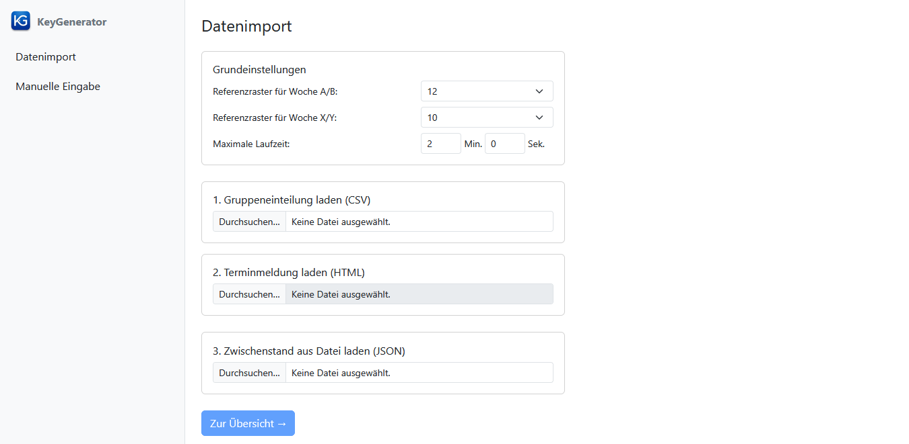

[← 2. Dateistruktur](02_dateistruktur.md) | [Inhaltsverzeichnis](README.md) | [4. Manuelle Eingabe →](04_manuelle_eingabe.md)

---

# 3. Datenimport

Öffnen Sie die Web-Anwendung in Ihrem Browser unter der entsprechenden URL.
Die Anwendung ist wie folgt aufgebaut:

- **Linke Seite (Seitenleiste)**: Navigationsmenü mit Links zu den einzelnen Seiten sowie Export- und Importfunktionen.
- **Rechte Seite (Hauptbereich)**: Zeigt den Inhalt der aktuell geöffneten Seite.

> **Hinweis:** Beim ersten Öffnen enthält die Seitenleiste nur den Link **Datenimport**. Sobald Daten geladen wurden, erscheinen die Links **Übersicht** und **Manuelle Eingabe** sowie — unterhalb eines Trennstrichs — die Import- und Exportfunktionen. Der Link **Konflikte auflösen** erscheint erst nach dem Abschluss einer Generierung und verschwindet wieder, wenn ein Backup geladen oder ein neuer Datenimport durchgeführt wird.

> **Ansicht: Startseite der Web-Anwendung**
>
> Die Datenimport-Seite nach dem Öffnen der Anwendung: In der Seitenleiste links ist zunächst nur der Link "Datenimport" sichtbar; im Hauptbereich rechts befinden sich die Schritte zum Laden von Daten sowie die Grundeinstellungen.
>
> 

## 3.1 Grundeinstellungen

Auf der Datenimport-Seite befinden sich im Bereich **Grundeinstellungen** die folgenden Konfigurationsoptionen, die vor dem Import überprüft werden sollten.

### Referenzraster einstellen

Die Referenzrastergrößen legen fest, welche Schlüsselzahlen auf Vereinsebene maximal vergeben werden können:

- **Referenzraster für Woche A/B**: Bestimmt die Rastergröße für die Spielwochen A und B.
- **Referenzraster für Woche X/Y**: Bestimmt die Rastergröße für die Spielwochen X und Y.

Die möglichen Rastergrößen sind **6, 8, 10, 12** und **14**.
Die Voreinstellungen (standardmäßig 12 für A/B und 10 für X/Y) sind in der eingebetteten Konfiguration hinterlegt und werden beim Start automatisch geladen.

Falls abweichende Referenzraster benötigt werden, kann eine angepasste Konfigurationsdatei über den Link **Konfiguration importieren** in der Seitenleiste eingelesen werden (siehe [7.4 Konfiguration exportieren und importieren](07_sonstige_funktionen.md#74-konfiguration-exportieren-und-importieren)).

> **Beispiel: Referenzraster**
>
> In unserem Beispiel sind die Referenzraster wie folgt eingestellt:
> - **Referenzraster A/B**: 12 – Die Erwachsenen-Gruppen spielen mit Rastergröße 12.
> - **Referenzraster X/Y**: 10 – Die Jugend- und Damen-Gruppen spielen mit Rastergröße 10.
>
> Das bedeutet: Auf Vereinsebene können für die Wochen A und B Schlüsselzahlen von 1 bis 12 vergeben werden, für die Wochen X und Y Schlüsselzahlen von 1 bis 10.

### Begrenzung der Laufzeit

Da die Ermittlung der Schlüsselzahlen ein komplexes Optimierungsproblem darstellt, wird die Generierung serverseitig ausgeführt.
Wenn das Programm vor Ablauf der Zeit die optimale Lösung findet, wird die Suche automatisch vorzeitig beendet.
Andernfalls wird nach Ablauf der maximalen Laufzeit die beste bis dahin gefundene Lösung verwendet.

## 3.2 Import aus Click-TT

Auf der Datenimport-Seite sind die Importschritte von Anfang an sichtbar.
Schritt 2 ist zunächst deaktiviert und wird erst nach Abschluss von Schritt 1 freigegeben.
Schritt 3 ist unabhängig von den anderen Schritten und kann jederzeit verwendet werden (siehe auch [3.3 Laden aus Datei](#33-laden-aus-datei)).

### Schritt 1: Gruppeneinteilung laden (CSV)

Dieser Schritt dient dem Import der Gruppen und ihrer Mannschaften.

1. Klicken Sie auf **Durchsuchen...** im ersten Schritt.
2. Wählen Sie eine CSV-Datei aus, die die Gruppeninformationen enthält (z.B. `Tabellen.csv`). Diese muss zuvor aus Click-TT heruntergeladen worden sein (Abschnitt [B.1](B_download_aus_click-tt.md#b1-gruppenstruktur-als-csv-datei-herunterladen)).
3. Nach dem Import erscheint eine grüne Bestätigung mit der Anzahl der geladenen Gruppen und Teams. Die Rastergrößen der Gruppen werden automatisch anhand der Teamanzahl ermittelt und können anschließend manuell angepasst werden (Abschnitt [4. Manuelle Eingabe](04_manuelle_eingabe.md)).

Nach erfolgreichem Abschluss von Schritt 1 wird Schritt 2 freigeschaltet.
Außerdem erweitert sich die Seitenleiste um die Links **Übersicht**, **Manuelle Eingabe** sowie die Export- und Importfunktionen.

### Schritt 2: Terminmeldung laden (HTML)

Dieser Schritt dient dem Import der Vereinsinformationen und Spielwochenwünsche.
Er ist erst verfügbar, nachdem Schritt 1 abgeschlossen wurde.

1. Klicken Sie auf **Durchsuchen...** im zweiten Schritt.
2. Wählen Sie eine HTML-Datei aus, die die Terminmeldungen enthält. Diese muss zuvor wie in den Abschnitten [B.2](B_download_aus_click-tt.md#b2-terminmeldung-als-pdf-datei-herunterladen) – [B.4](B_download_aus_click-tt.md#b4-terminmeldung-in-eine-html-datei-konvertieren) beschrieben erstellt worden sein. Wir hoffen, dass in naher Zukunft ein direkter Download der Terminmeldung in Click-TT zur Verfügung steht.
3. Nach dem Import erscheint eine grüne Bestätigung mit der Anzahl der geladenen Vereine.

Nach erfolgreichem Import beider Dateien wird die Schaltfläche **Zur Übersicht →** am unteren Rand der Seite aktiv; alternativ können Sie auch über den Link **Übersicht** in der Seitenleiste zur zentralen Arbeitsfläche wechseln.

## 3.3 Laden aus Datei

Wenn Sie bereits zu einem früheren Zeitpunkt einen Zwischenstand gespeichert haben, können Sie diese über den dritten Schritt ("3. Zwischenstand aus Datei laden (JSON)") wiederherstellen.
Dieser Schritt ist unabhängig von den anderen Schritten und kann auch ohne vorherigen CSV-Import verwendet werden.

1. Klicken Sie auf **Durchsuchen...** im dritten Schritt.
2. Wählen Sie eine JSON-Datei aus (z.B. `Data.json`).
3. Nach dem Laden werden alle Vereine, Gruppen und Mannschaften in der Anwendung wiederhergestellt.

## 3.4 Rückgängig und Wiederherstellen

Manuelle Änderungen können sowohl auf der Seite **Übersicht** als auch auf der Seite **Manuelle Eingabe** rückgängig gemacht und wiederhergestellt werden.
Auf beiden Seiten stehen dafür folgende Schaltflächen bereit:

- **↶ Rückgängig** (oder **Strg+Z**): Letzte Änderung rückgängig machen.
- **↷ Wiederherstellen** (oder **Strg+Y**): Rückgängig gemachte Änderung wiederherstellen.

Die Änderungshistorie wird beim Laden neuer Daten sowie beim Start einer neuen Generierung automatisch zurückgesetzt.
Um auf den Stand vor der Generierung zurückzukehren, wird automatisch ein Backup angelegt (siehe [7.1 Backup laden](07_sonstige_funktionen.md#71-backup-laden)).

---

[← 2. Dateistruktur](02_dateistruktur.md) | [Inhaltsverzeichnis](README.md) | [4. Manuelle Eingabe →](04_manuelle_eingabe.md)
