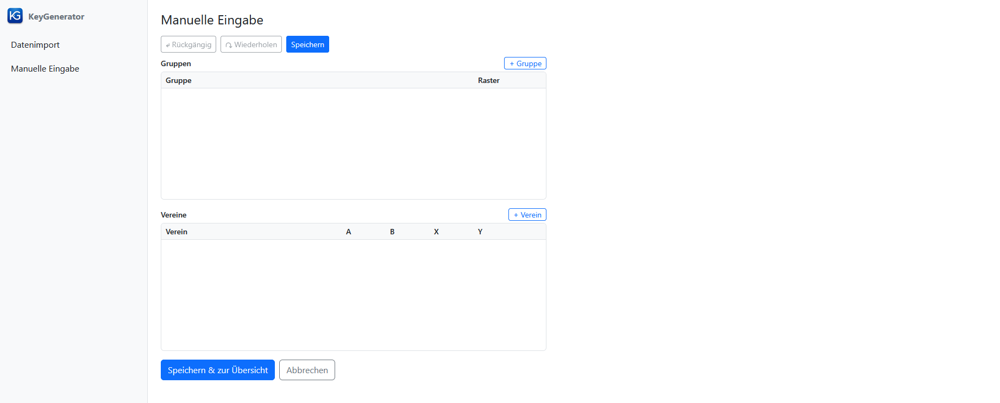
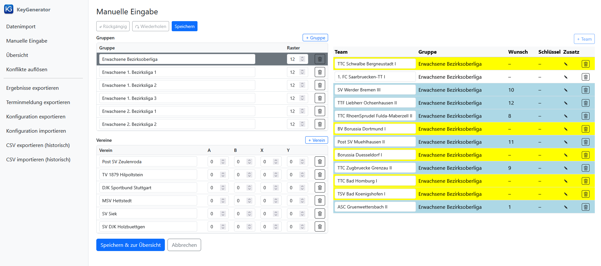
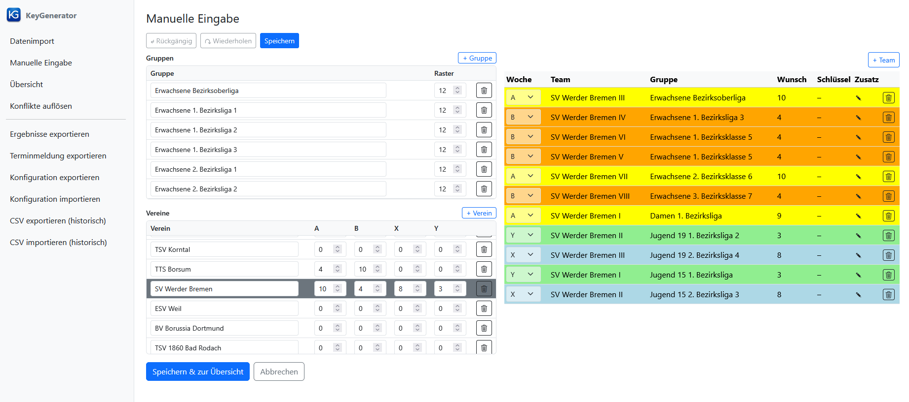

[← 3. Datenimport](03_datenimport.md) | [Inhaltsverzeichnis](README.md) | [5. Übersicht →](05_startbildschirm.md)

---

# 4. Manuelle Eingabe

Die Seite **Manuelle Eingabe** ermöglicht die manuelle Eingabe und Bearbeitung von Gruppen, Vereinen und Mannschaften.
Sie ist über den gleichnamigen Link in der Seitenleiste erreichbar.

Am oberen Rand der Seite befinden sich drei Schaltflächen: **↶ Rückgängig** (oder **Strg+Z**), **↷ Wiederherstellen** (oder **Strg+Y**) und **Speichern** (blau, oder **Strg+S**). Die Schaltfläche **Speichern** sichert den aktuellen Bearbeitungsstand, ohne die Seite zu verlassen.

Die Seite ist in zwei nebeneinander angeordnete Bereiche unterteilt: eine linke Spalte mit Gruppen- und Vereinstabelle sowie eine rechte Spalte mit der Mannschaftstabelle.

> **Ansicht: Manuelle Eingabe – leere Seite**
>
> Die Seite "Manuelle Eingabe" im Ausgangszustand: Links oben die noch leere Gruppentabelle, links unten die noch leere Vereinstabelle. Die rechte Spalte mit der Mannschaftstabelle erscheint erst, wenn eine Gruppe oder ein Verein ausgewählt wird.
>
> 

## Linke Spalte: Gruppentabelle

Die obere Tabelle in der linken Spalte zeigt alle Gruppen mit folgenden Spalten:

| Spalte | Bedeutung |
|--------|-----------|
| Gruppe | Name der Gruppe |
| Raster | Rastergröße der Gruppe |

**Gruppen anlegen:**
Klicken Sie auf die Schaltfläche **+ Gruppe**.
Die neue Gruppe wird mit dem Standard-Referenzraster der Spielwochen A/B und dem Standardnamen "Neue Gruppe" angelegt.
Name und Rastergröße können direkt in der Tabelle bearbeitet werden.

**Gruppe auswählen:**
Klicken Sie auf eine Zeile in der Gruppentabelle, um die zugehörigen Mannschaften in der rechten Spalte anzuzeigen (Gruppenansicht).

**Gruppen löschen:**
Klicken Sie auf das Lösch-Symbol (Papierkorb) in der entsprechenden Zeile.
Eine Gruppe kann nur gelöscht werden, wenn sie keine Mannschaften mehr enthält; andernfalls erscheint eine Fehlermeldung.

> **Ansicht: Manuelle Eingabe – Gruppenansicht**
>
> Die Seite "Manuelle Eingabe" in der Gruppenansicht: Links oben die Gruppen mit Rastergrößen, links unten die Vereine, rechts die Mannschaften der ausgewählten Gruppe.
>
> 

## Linke Spalte: Vereinstabelle

Die untere Tabelle in der linken Spalte zeigt alle Vereine mit folgenden Spalten:

| Spalte | Bedeutung |
|--------|-----------|
| Verein | Name des Vereins |
| A | Schlüsselzahl für Spielwoche A (Referenzraster A/B) |
| B | Schlüsselzahl für Spielwoche B (automatisch berechnet) |
| X | Schlüsselzahl für Spielwoche X (Referenzraster X/Y) |
| Y | Schlüsselzahl für Spielwoche Y (automatisch berechnet) |

**Vereine anlegen:**
Klicken Sie auf die Schaltfläche **+ Verein**.
Der neue Verein wird mit einem Standardnamen angelegt; Name und Schlüsselzahlen können direkt in der Tabelle bearbeitet werden.
Legen Sie zunächst alle Vereine an, bevor Sie mit der Zuordnung von Mannschaften zu den Gruppen beginnen.

**Verein auswählen:**
Klicken Sie auf eine Zeile in der Vereinstabelle, um die zugehörigen Mannschaften in der rechten Spalte anzuzeigen (Vereinsansicht).
In dieser Ansicht ist auch die Spielwochenzuordnung der Mannschaften sichtbar und bearbeitbar.

**Vorgegebene Schlüsselzahlen einstellen:**
Wenn vom Verband oder Bezirk bereits Schlüsselzahlen für bestimmte Vereine vorgegeben sind, tragen Sie diese in der entsprechenden Spalte (A, B, X oder Y) ein.
Die gegenläufige Schlüsselzahl (also B zu A, Y zu X usw.) wird automatisch berechnet.
Es können nur Zahlen eingetragen werden, die für das eingestellte Referenzraster gültig sind.

**Vereine löschen:**
Klicken Sie auf das Lösch-Symbol (Papierkorb) in der entsprechenden Zeile.
Ein Verein kann nur gelöscht werden, wenn keine seiner Mannschaften noch einer Gruppe zugeordnet ist; andernfalls erscheint eine Fehlermeldung.

> **Beispiel: Vorgegebene Schlüsselzahlen**
>
> Vor der Generierung hatten einige Vereine der Bezirksoberliga bereits vorgegebene Schlüsselzahlen (z.B. vom DTTB oder Verband).
> Der folgende Screenshot zeigt einen Auszug aus der Vereinsansicht:
>
> 
>
> Für den SV Werder Bremen sind Schlüsselzahlen für alle vier Wochen vorgegeben.
> Einige Vereine wie TTS Borsum haben Vorgaben nur für `A`/`B`.
> Andere Vereine wie Borussia Düsseldorf und BV Borussia Dortmund hatten zum Zeitpunkt vor der Generierung noch keine Schlüsselzahlen – diese werden dann vollständig vom Tool ermittelt.
> Die Spalte `B` wird jeweils automatisch aus `A` berechnet (und `Y` aus `X`).

## Rechte Spalte: Mannschaftstabelle

Die rechte Spalte erscheint, sobald eine Gruppe oder ein Verein in der linken Spalte ausgewählt wird.
Sie zeigt Mannschaftsdaten in zwei alternativen Anzeigemodi:

- **Gruppenansicht**: Wird aktiviert durch Klick auf eine Zeile in der **Gruppentabelle** (links oben). Zeigt alle Mannschaften der ausgewählten Gruppe. Die Spalte "Woche" ist ausgeblendet.
- **Vereinsansicht**: Wird aktiviert durch Klick auf eine Zeile in der **Vereinstabelle** (links unten). Zeigt alle Mannschaften des ausgewählten Vereins gruppenübergreifend. Die Spalte "Woche" ist sichtbar und bearbeitbar (`A`, `B`, `X`, `Y` oder leer für keine Zuordnung).

Ein Klick auf das Bearbeiten-Symbol (Stift) in der Spalte **Zusatz** öffnet den Zusatz-Dialog (siehe [5.3 Zusätzliche Einstellungen für einzelne Teams](05_startbildschirm.md#53-zusätzliche-einstellungen-für-einzelne-teams)), in dem feste Vorgaben für Heim- und Auswärtsspiele in bestimmten Spielwochen eingetragen werden können.

**Mannschaften anlegen:**
Wählen Sie zunächst in der Gruppentabelle (links oben) die gewünschte Gruppe aus.
In der oberen rechten Ecke der rechten Spalte erscheint dann die Schaltfläche **+ Team**.
Klicken Sie darauf, um die Daten für eine neue Mannschaft einzugeben.
Wählen Sie dort den Verein aus und tragen Sie ggf. die Mannschaftsnummer ein.
Klicken Sie auf **Hinzufügen**, um die Mannschaft der Gruppe hinzuzufügen, sofern noch Platz vorhanden ist (Rastergröße nicht überschritten).

**Mannschaften löschen:**
Klicken Sie auf das Lösch-Symbol (Papierkorb) in der Spalte **Zusatz** der entsprechenden Zeile.

**Speichern:**
Am unteren Rand der Seite befinden sich die Schaltflächen **Speichern & zur Übersicht** und **Abbrechen**.
Ein Klick auf **Speichern & zur Übersicht** übernimmt alle Änderungen und wechselt zur Übersichtsseite.
Ein Klick auf **Abbrechen** verwirft die seit dem letzten Speichern vorgenommenen Änderungen und kehrt zur vorherigen Seite zurück.

---

[← 3. Datenimport](03_datenimport.md) | [Inhaltsverzeichnis](README.md) | [5. Übersicht →](05_startbildschirm.md)
