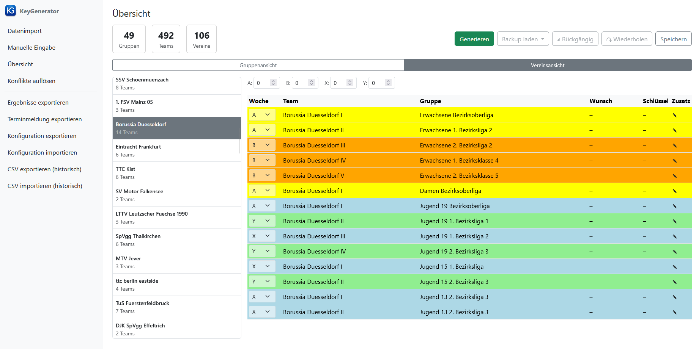
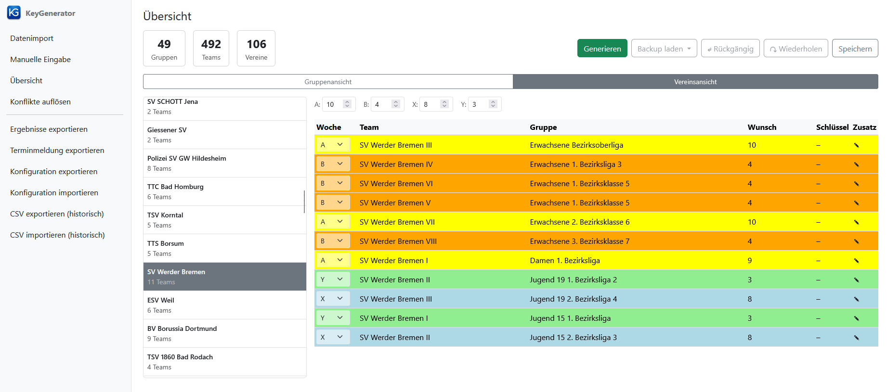
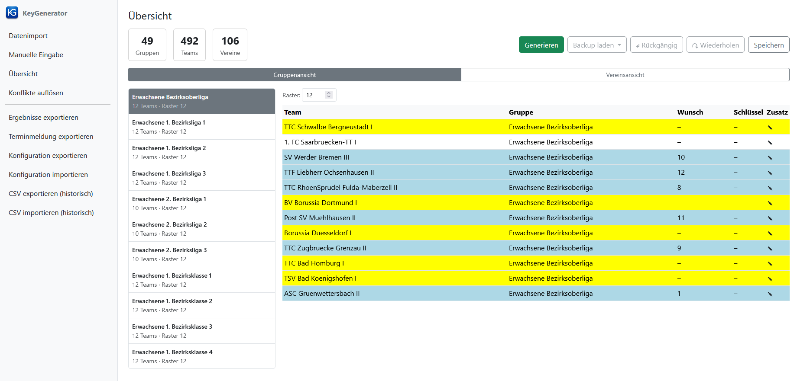
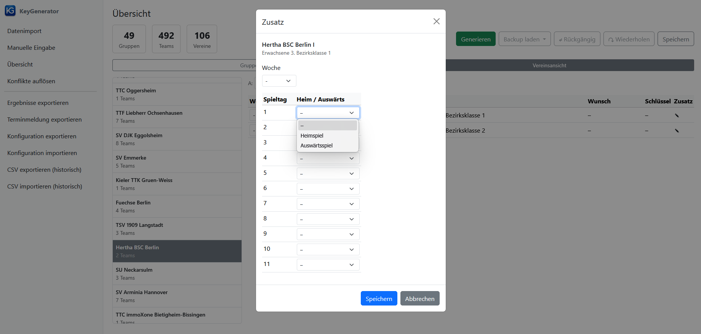
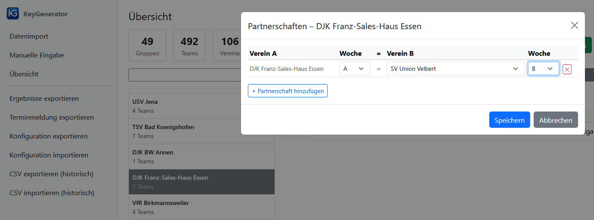

[← 4. Manuelle Eingabe](04_manuelle_eingabe.md) | [Inhaltsverzeichnis](README.md) | [6. Schlüsselzahlen generieren →](06_generierung.md)

---

# 5. Übersicht

Die **Übersicht** ist die zentrale Arbeitsfläche der Web-Anwendung und wird über den Link **Übersicht** in der Seitenleiste aufgerufen.
Sie ist erst erreichbar, nachdem Daten geladen wurden.

Im oberen Bereich der Übersicht befinden sich links drei Kennzahlen-Kacheln (Anzahl der Gruppen, Teams und Vereine) und rechts die folgenden Schaltflächen:

- **Generieren**: Startet die automatische Schlüsselzahlgenerierung (siehe [6. Schlüsselzahlen generieren](06_generierung.md)).
- **Backup laden**: Öffnet ein Dropdown-Menü mit den verfügbaren Sicherheitskopien der aktuellen Sitzung (siehe [7.1 Backup laden](07_sonstige_funktionen.md#71-backup-laden)).
- **↶ Rückgängig** (oder **Strg+Z**): Letzte Änderung rückgängig machen.
- **↷ Wiederherstellen** (oder **Strg+Y**): Rückgängig gemachte Änderung wiederherstellen.
- **Speichern** (oder **Strg+S**): Lädt die aktuellen Daten als `Data.json` herunter.

Darunter befindet sich eine Umschaltleiste, mit der zwischen den beiden Ansichten der Datentabelle gewechselt wird:

- **Gruppenansicht**: Zeigt alle Mannschaften einer ausgewählten Gruppe an.
- **Vereinsansicht**: Zeigt alle Mannschaften eines ausgewählten Vereins gruppenübergreifend an.

Die folgenden Abschnitte beschreiben beide Ansichten sowie die Möglichkeit, zusätzliche Einstellungen für einzelne Teams vorzunehmen.

## 5.1 Vereinsansicht

In der Vereinsansicht wählen Sie in der linken Spalte einen Verein aus der Liste aus.
Jeder Listeneintrag zeigt den Vereinsnamen sowie die Anzahl seiner Mannschaften.
Daraufhin werden alle Mannschaften dieses Vereins in der Tabelle rechts angezeigt.

Oberhalb der Tabelle befinden sich vier Zahlenfelder (`A`, `B`, `X`, `Y`).
Hier können Sie die Schlüsselzahlen auf Vereinsebene einstellen (komfortabler geht dies über die Seite [4. Manuelle Eingabe: Vereinstabelle](04_manuelle_eingabe.md#linke-spalte-vereinstabelle)).
Die Werte A und B bzw. X und Y sind jeweils aneinander gekoppelt: Wenn Sie eine Schlüsselzahl für A eingeben, wird die entgegengesetzte Schlüsselzahl für B automatisch berechnet (und umgekehrt).

### Tabellenspalten

| Spalte | Bedeutung |
|--------|-----------|
| Woche | Zugeordnete Spielwoche (A, B, X, Y oder leer). Bearbeitung: Klicken Sie auf das Dropdown-Menü in der Zelle und wählen Sie die gewünschte Woche. |
| Team | Name der Mannschaft |
| Gruppe | Name der Gruppe, in der die Mannschaft spielt |
| Wunsch | Mögliche Schlüsselzahlen basierend auf der Spielwochenvorgabe des Vereins |
| Schlüssel | Zugewiesene Schlüsselzahl nach der Generierung |
| Zusatz | Schaltfläche zum Öffnen des Zusatz-Dialogs (siehe [5.3 Zusätzliche Einstellungen für einzelne Teams](#53-zusaetzliche-einstellungen-fuer-einzelne-teams)) |

### Farbcodierung in der Vereinsansicht

Die Zeilen werden je nach Spielwoche farblich hervorgehoben:

| Spielwoche | Farbe | Bedeutung |
|------------|-------|-----------|
| A | Gelb | Spielwoche A |
| B | Orange | Spielwoche B |
| X | Blau | Spielwoche X |
| Y | Grün | Spielwoche Y |
| – | Weiß | Keine Spielwoche zugeordnet |

### Spielwochenzuordnung

In der Spalte "Woche" ist für jede Mannschaft ein Dropdown-Menü sichtbar.
Klicken Sie darauf und wählen Sie den Buchstaben der Spielwoche (`A`, `B`, `X`, `Y`).
Um die Zuordnung zu entfernen, wählen Sie den leeren Eintrag (`-`).

> **Beispiel: Vereinsansicht ohne Schlüsselzahlen-Vorgabe**
>
> Der folgende Screenshot zeigt alle Mannschaften von Borussia Düsseldorf mit entsprechender farblicher Codierung für die Spielwoche.
> Vor der Generierung sind sowohl die Spalte "Schlüssel" als auch die Spalte "Wunsch" leer, da der Verein keine Schlüsselzahlenvorgabe von einer höheren Gliederungsebene hat:
>
> 

> **Beispiel: Vereinsansicht mit Schlüsselzahlen-Vorgabe**
>
> Der folgende Screenshot zeigt die Mannschaften von SV Werder Bremen. Oberhalb der Tabelle sind die Eingabefelder A, B, X und Y zu sehen, in denen die Vorgabewerte eingestellt sind. Die Zeilen sind entsprechend ihrer Spielwoche farblich hervorgehoben. Die Spalte "Schlüssel" ist auch bei diesem Verein leer, die Spalte "Wunsch" blendet die Schlüsselzahl(en) vor, die bei der entsprechenden Spielwoche benötigt werden.
>
> 

## 5.2 Gruppenansicht

Die Gruppenansicht gibt einen Überblick über alle Teams einer Gruppe.
Wählen Sie dazu in der linken Spalte die gewünschte Gruppe aus der Liste aus.
Jeder Listeneintrag zeigt den Gruppennamen sowie die Teamanzahl und die Rastergröße.

Oberhalb der Tabelle erscheint das Feld **Raster**, in dem die Rastergröße der Gruppe geändert werden kann (eine komfortablere Alternative bietet die Seite [4. Manuelle Eingabe: Gruppentabelle](04_manuelle_eingabe.md#linke-spalte-gruppentabelle)).
Die Rastergröße muss mindestens so groß sein wie die Anzahl der Mannschaften in der Gruppe (aufgerundet auf eine gerade Zahl) und darf maximal 14 betragen.
Die maximale Rastergröße gilt nur für die Standard-Konfiguration. Durch das Laden einer anderen Konfiguration (siehe [7.4 Konfiguration exportieren und importieren](07_sonstige_funktionen.md#74-konfiguration-exportieren-und-importieren)) können beliebig große Raster verwendet werden.

### Tabellenspalten in der Gruppenansicht

Die Tabelle zeigt folgende Spalten (die Spalte "Woche" ist in der Gruppenansicht *nicht* sichtbar), wobei alle Spalten nur zur Anzeige verfügbar sind:

| Spalte | Bedeutung |
|--------|-----------|
| Team | Name der Mannschaft |
| Gruppe | Name der Gruppe |
| Wunsch | Benötigte Schlüsselzahl(en) |
| Schlüssel | Zugewiesene oder vorgegebene Schlüsselzahl |
| Zusatz | Schaltfläche zum Öffnen des Zusatz-Dialogs (siehe [5.3](#53-zusaetzliche-einstellungen-fuer-einzelne-teams)) |

### Farbcodierung in der Gruppenansicht

In der Gruppenansicht werden die Zeilen nach dem Zuweisungsstatus eingefärbt:

| Farbe | Bedeutung |
|-------|-----------|
| Grün | Gültige Schlüsselzahl zugewiesen, die den Wunsch-Schlüsselzahlen entspricht und in der Gruppe eindeutig ist |
| Blau | Team hat eine Spielwoche und Wunsch-Schlüsselzahlen (Vorgabe durch höhere Ebene), aber noch keine zugewiesene Schlüsselzahl |
| Gelb | Team hat eine Spielwochen-Vorgabe, der Verein hat aber keine Schlüsselzahlen-Vorgabe durch eine höhere Ebene; *oder*: Team hat keine Spielwochen-Vorgabe, aber Vorgaben für Heim- oder Auswärtsspiele |
| Orange | Schlüsselzahl stimmt nicht mit den Wunsch-Schlüsselzahlen überein; *oder*: die zugewiesene Schlüsselzahl ist in der Gruppe doppelt vergeben (ungelöster Konflikt) |
| Weiß | Team hat keine Spielwoche und keine sonstigen Vorgaben |

Die Gruppenansicht eignet sich besonders zur **Kontrolle nach der Generierung**, da hier auf einen Blick alle Schlüsselzahlen einer Gruppe sichtbar sind.
Orange eingefärbte Zeilen weisen auf Konflikte hin, die auch im Nachgang über den Link **Konflikte auflösen** in der Seitenleiste (siehe [6.2 Konflikte auflösen](06_generierung.md#62-konflikte-aufloesen)) behoben werden können.

> **Beispiel: Gruppenansicht – Bezirksoberliga Erwachsene vor der Generierung**
>
> Der folgende Screenshot zeigt die Bezirksoberliga Erwachsene (Rastergröße 12, 12 Teams) im Zustand *vor* der Generierung.
> Zu diesem Zeitpunkt waren viele Spielwochen bereits zugeordnet, aber die Schlüsselzahlen noch nicht vergeben:
>
> 
>
> Hier sind drei Farben zu erkennen:
> - **Blau**: Teams, deren Verein bereits eine vorgegebene Schlüsselzahl hat (z.B. SV Werder Bremen mit A=10). Die Wunsch-Schlüsselzahlen können berechnet werden, aber die Mannschafts-Schlüsselzahl fehlt noch.
> - **Gelb**: Teams, deren Verein noch keine Schlüsselzahl hat (z.B. Borussia Düsseldorf, BV Borussia Dortmund). Es können weder Wunsch noch Schlüsselzahl angezeigt werden.
> - **Weiß**: 1. FC Saarbrücken-TT I hat keine Spielwoche (Woche = `-`) und somit auch keine Wunsch-Schlüsselzahl.

## 5.3 Zusätzliche Einstellungen für einzelne Teams

Mit einem Klick auf das Bearbeiten-Symbol (Stift) in der Spalte **Zusatz** öffnet sich der Dialog "Zusatz".
Dieser Dialog ist sowohl in der Vereins- als auch in der Gruppenansicht verfügbar.
Hier können Sie folgende Einstellungen vornehmen:

### Spielwoche festlegen

Im Dropdown-Menü "Woche" können Sie die Spielwoche des Teams auswählen (`-`, `A`, `B`, `X`, `Y`).
Die Einstellung kann genauso über die Vereinsansicht in der Übersicht (Abschnitt 5.1) oder über die Manuelle Eingabe (Abschnitt [Rechte Spalte: Mannschaftstabelle](04_manuelle_eingabe.md#rechte-spalte-mannschaftstabelle)) vorgenommen werden.

### Heim- und Auswärtsspieltage festlegen

Unterhalb der Spielwochenauswahl befindet sich eine Tabelle mit zwei Spalten:

| Spalte | Bedeutung |
|--------|-----------|
| Spieltag | Nummer des Spieltags (1, 2, 3, …) |
| Heim / Auswärts | Dropdown-Menü mit den Optionen `-` (keine Vorgabe), `Heimspiel` oder `Auswärtsspiel` |

Die Anzahl der angezeigten Spieltage wird dynamisch anhand der Rastergröße der Gruppe bestimmt.
Bei einer Gruppe mit Rastergröße 12 werden beispielsweise 11 Spieltage angezeigt, bei Rastergröße 10 entsprechend 9.

Bestätigen Sie Ihre Eingaben mit **Speichern** oder verwerfen Sie sie mit **Abbrechen**.

**Hinweis:** Verwenden Sie diese Funktion sparsam, da sie die Schlüsselzahlfindung erheblich erschwert und unter Umständen eine gute Lösung verhindern kann.

> **Ansicht: Dialog „Zusatz"**
>
> Der Dialog „Zusatz" mit der Spielwochenauswahl oben und der Tabelle für Heim-/Auswärtsvorgaben je Spieltag darunter. Die Anzahl der Spieltage richtet sich nach der Rastergröße der Gruppe.
>
> 

## 5.4 Partnerschaften

Eine **Partnerschaft** legt fest, dass Abhängigkeiten zwischen Spielwochen unterschiedlicher Vereine bestehen.
Solche Vorgaben entstehen typischerweise durch gemeinsam genutzte Hallenzeiten oder organisatorische Abhängigkeiten zwischen zwei Vereinen.

Die Partnerschaftsfunktion ist in der **Vereinsansicht** verfügbar.
Wählen Sie zunächst in der linken Spalte den gewünschten Verein aus.
Oberhalb der Mannschaftstabelle erscheint daraufhin die Schaltfläche **Partner**.
Nach einem Klick darauf öffnet sich der Dialog **Partnerschaften**.

### Aufbau des Dialogs

Der Dialog zeigt eine Tabelle mit allen Partnerschaften des ausgewählten Vereins.
Jede Zeile beschreibt eine Partnerschaft nach dem Schema:

> *Verein A in Woche X* = *Verein B in Woche Y*

Die Spalten im Einzelnen:

| Spalte | Bedeutung |
|--------|-----------|
| Verein A | Immer der ausgewählte Verein (schreibgeschützt) |
| Woche | Spielwoche des ausgewählten Vereins (`A`, `B`, `X` oder `Y`) |
| Verein B | Partnerverein (Dropdown-Menü mit allen anderen Vereinen) |
| Woche | Spielwoche des Partnervereins (`A`, `B`, `X` oder `Y`) |
| ✕ | Löscht die Zeile |

Der ausgewählte Verein erscheint unabhängig davon, auf welcher Seite die Partnerschaft ursprünglich angelegt wurde, immer in der Spalte „Verein A".

> **Hinweis:** Es ist nicht möglich, einen Verein mit sich selbst als Partner einzutragen.

### Partnerschaft hinzufügen

Klicken Sie auf die Schaltfläche **+ Partnerschaft hinzufügen** unterhalb der Tabelle.
Eine neue Zeile wird eingefügt, in der der ausgewählte Verein bereits als Verein A eingetragen ist und beide Wochen auf `A` voreingestellt sind.
Wählen Sie den gewünschten Partnerverein im Dropdown-Menü der Spalte „Verein B" aus und passen Sie die Spielwochen bei Bedarf an.

### Partnerschaft entfernen

Klicken Sie in der entsprechenden Zeile auf die Schaltfläche **✕** in der letzten Spalte.
Die Zeile wird sofort entfernt.

### Änderungen speichern

Bestätigen Sie Ihre Eingaben mit **Speichern** oder verwerfen Sie sie mit **Abbrechen**.
Gespeicherte Partnerschaften werden in der aktuellen Sitzung dauerhaft hinterlegt und beim Export über **Speichern** (oder **Strg+S**) in die Datei `Data.json` einbezogen.

> **Beispiel: Partnerschaft zwischen DJK Franz-Sales-Haus Essen und SV Union Velbert**
>
> DJK Franz-Sales-Haus Essen und SV Union Velbert teilen sich eine Halle, sodass Abhängigkeiten zwischen den Mannschaften beider Vereine berücksichtigt werden müssen.
> In der Vereinsansicht wird DJK Franz-Sales-Haus Essen ausgewählt und die Schaltfläche **Partner** angeklickt.
> Der Dialog „Partnerschaften" zeigt daraufhin die folgende Zeile:
>
> | Verein A | Woche | Verein B | Woche | |
> |----------|-------|----------|-------|-|
> | DJK Franz-Sales-Haus Essen | A | SV Union Velbert | B | ✕ |
>
> 

---

[← 4. Manuelle Eingabe](04_manuelle_eingabe.md) | [Inhaltsverzeichnis](README.md) | [6. Schlüsselzahlen generieren →](06_generierung.md)
