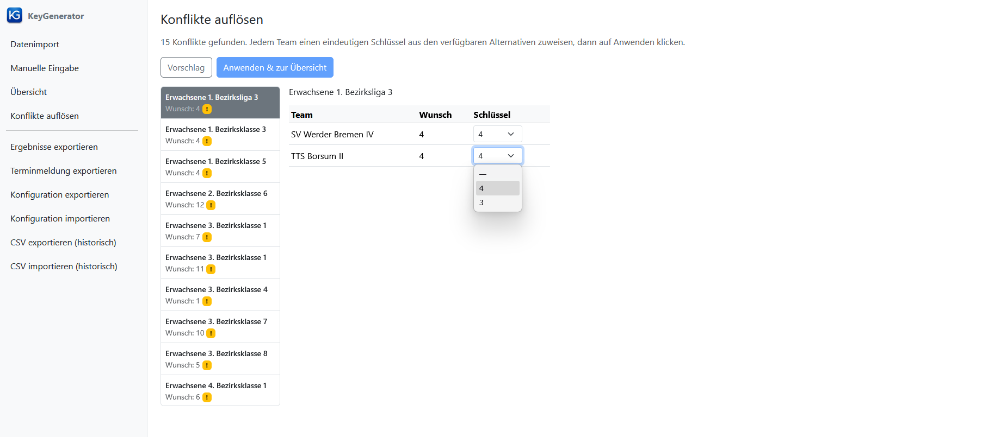
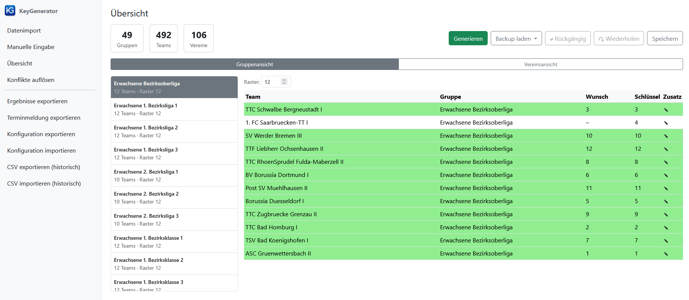
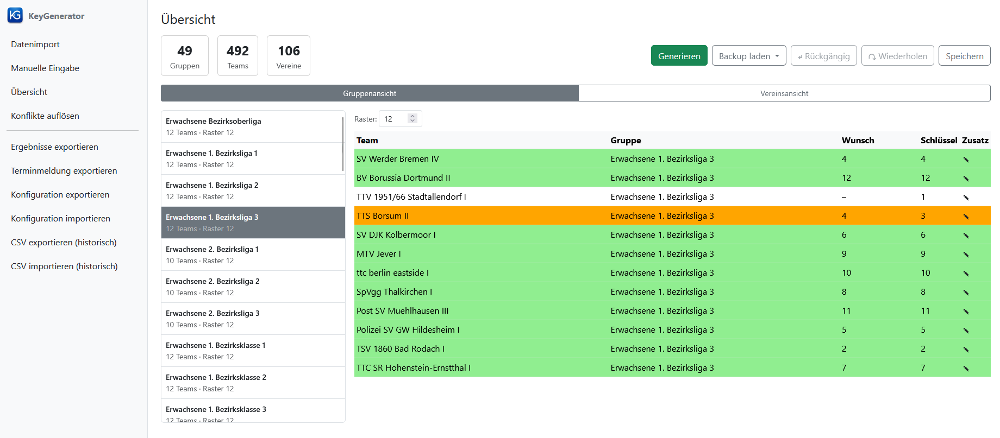
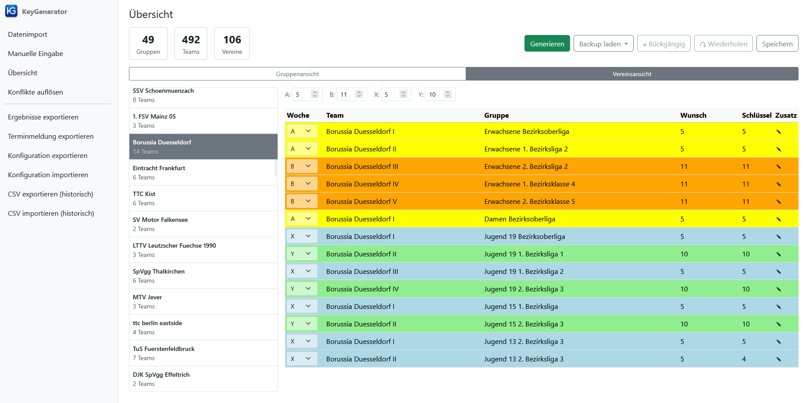

[← 5. Übersicht](05_startbildschirm.md) | [Inhaltsverzeichnis](README.md) | [7. Sonstige Funktionen →](07_sonstige_funktionen.md)

---

# 6. Schlüsselzahlen generieren

Nachdem alle Daten eingegeben und alle Wünsche der Vereine berücksichtigt worden sind, kann die eigentliche Generierung der Schlüsselzahlen beginnen.

1. Klicken Sie in der [Übersicht](05_startbildschirm.md) auf den Button **Generieren**.
2. Vor der Generierung wird automatisch eine Sicherheitskopie des aktuellen Standes angelegt, die Sie bei Bedarf später wiederherstellen können (siehe [7.1 Backup laden](07_sonstige_funktionen.md#71-backup-laden)).
3. Die Anwendung wechselt auf die Seite **Optimierung**, die einen Fortschrittsbalken und den aktuellen Status anzeigt.
4. Sie können die Generierung jederzeit über den Button **Abbrechen** vorzeitig beenden.

**Hinweis:** Vor der Generierung wird eine Plausibilitätsprüfung durchgeführt.
Wenn widersprüchliche Vorgaben erkannt werden (z.B. inkonsistente Spieltagsvorgaben für Teams desselben Vereins in derselben Spielwoche), erscheint eine Fehlermeldung.

## 6.1 Konflikte beheben

Nach Abschluss der Optimierung wechselt die Anwendung auf die Seite **Konflikte auflösen**, falls Konflikte aufgetreten sind (was der Normalfall sein sollte).
Ein Konflikt liegt vor, wenn mehrere Teams einer Gruppe dieselbe Schlüsselzahl beanspruchen.

Am oberen Rand der Seite wird die Anzahl der gefundenen Konflikte angezeigt.
Darunter befinden sich die Schaltflächen **Vorschlag** und **Anwenden & zur Übersicht**.

Die Seite ist in zwei Bereiche unterteilt:
- **Linke Spalte**: Liste aller Konflikte, gegliedert nach Gruppe und Wunsch-Schlüsselzahl. Jeder Eintrag zeigt den Gruppennamen und die betroffene Wunsch-Schlüsselzahl.
- **Rechter Bereich**: Für den ausgewählten Konflikt werden die betroffenen Mannschaften in einer Tabelle angezeigt:

| Spalte | Bedeutung |
|--------|-----------|
| Team | Name der Mannschaft |
| Wunsch | Die eigentlich gewünschte Schlüsselzahl der Mannschaft |
| Schlüssel | Dropdown-Menü, über das Sie der Mannschaft eine andere Schlüsselzahl zuweisen können |

Zur Auswahl stehen die ursprünglich gewünschte Schlüsselzahl sowie bis zu zwei ähnliche Schlüsselzahlen, die noch frei sind.

**Vorschlag:** Über den Button **Vorschlag** können Sie einen automatischen Lösungsvorschlag generieren lassen, bei dem die Konflikte zufällig aufgelöst werden. Dies sollten Sie im Interesse der betroffenen Vereine nur zu Testzwecken tun, und nicht zur Ermittlung der finalen Schlüsselzahlen!

> **Ansicht: Seite „Konflikte auflösen"**
>
> Die Seite zur manuellen Konfliktauflösung: Links die Liste der Konflikte, rechts die betroffenen Mannschaften des ausgewählten Konflikts. Für jede betroffene Mannschaft stehen die Wunsch-Schlüsselzahl und ähnliche freie Schlüsselzahlen als Alternative zur Auswahl.
>
> 

Klicken Sie auf **Anwenden & zur Übersicht**, nachdem Sie jeden Konflikt gelöst haben.
Falls ein Konflikt noch nicht aufgelöst ist oder für eine Mannschaft keine Schlüsselzahl vergeben wurde, erscheint eine entsprechende Fehlermeldung.
Sie können die Konfliktauflösung abbrechen, indem Sie über die Seitenleiste zur Übersicht navigieren.
Die verbliebenen Konflikte können zu einem späteren Zeitpunkt über den Link **Konflikte auflösen** in der Seitenleiste erneut aufgelöst werden (siehe [6.2 Konflikte auflösen](#62-konflikte-aufloesen)).

## 6.2 Konflikte auflösen

Nach dem Abschluss einer Generierung erscheint in der Seitenleiste der Link **Konflikte auflösen**.
Über diesen Link gelangen Sie jederzeit zurück auf die Seite zur Konfliktauflösung (wie in [6.1 Konflikte beheben](#61-konflikte-beheben) beschrieben), um Konflikte erneut zu bearbeiten.

Der Link bleibt sichtbar, bis ein Backup geladen oder ein neuer Datenimport durchgeführt wird.

## 6.3 Abschluss der Generierung

Nachdem alle Konflikte behoben wurden, wird die Zuweisung der Schlüsselzahlen abgeschlossen.
In diesem Schritt werden die noch freien Schlüsselzahlen an die verbleibenden Mannschaften ohne Spielwochenvorgaben zugewiesen.
Anschließend kehrt die Anwendung zur Übersicht zurück.

Falls die Generierung nicht erfolgreich war, kann dies folgende Ursachen haben:
- Widersprüchliche Vorgaben (z.B. unvereinbare Heim-/Auswärtsspielvorgaben).
- Nicht ausreichende Laufzeit – versuchen Sie es erneut.
- Zu viele feste Vorgaben, die eine Lösung unmöglich machen.

Eine Liste mit häufigen Fehlerquellen und deren Auflösung finden Sie in Abschnitt [9. Fehlerbehebung](09_fehlerbehebung.md).

## 6.4 Kontrolle und Übergabe

Nach der Generierung empfiehlt es sich, die Ergebnisse in der **Gruppenansicht** (siehe [5.2 Gruppenansicht](05_startbildschirm.md#52-gruppenansicht)) zu kontrollieren.
Da nun alle Teams eine Schlüsselzahl haben sollten, sind alle Zeilen grün, orange (im Konfliktfall) oder weiß (bei Mannschaften ohne Vorgaben) eingefärbt.
Mithilfe dieser Übersicht können Sie die Schlüsselzahlen in Click-TT oder in ein sonstiges Verwaltungssystem übertragen.

> **Beispiel: Gruppenansicht – Bezirksoberliga Erwachsene nach der Generierung**
>
> Nach der Generierung hat jedes Team eine Schlüsselzahl erhalten.
> Alle Zeilen sind nun **grün** (oder **orange**, falls Konflikte auftreten):
>
> 
>
> Alle 12 Schlüsselzahlen (1–12) sind genau einmal vergeben – es gibt keine Konflikte.
> Die Spalte "Wunsch" zeigt die aus der Vereins-Schlüsselzahl abgeleiteten Wunschzahlen.
> Beim 1. FC Saarbrücken-TT I ist kein Wunsch eingetragen, da der Verein keine vorgegebene Schlüsselzahl und auch keine Spielwoche hatte – die Zahl 4 wurde frei zugewiesen.

> **Beispiel: Gruppenansicht 1. Bezirksliga 3 Erwachsene nach der Generierung**
>
> Die 1. Bezirksliga 3 enthält nach der Generierung einen aufgelösten Konflikt: Die orange markierte Zeile kennzeichnet ein Team, bei dem die zugewiesene Schlüsselzahl von der Wunsch-Schlüsselzahl abweicht. Im Vorfeld wurde ein Konflikt zwischen SV Werder Bremen IV und TTS Borsum II dahingehend aufgelöst, dass Bremen die Schlüsselzahl 4, und Borsum die ähnliche Schlüsselzahl 3 zugewiesen wurde (Abschnitt [6.1 Konflikte beheben](#61-konflikte-beheben)).
>
> 

> **Beispiel: Vereinsansicht – Vergabe von parallelen und gegenläufigen Schlüsselzahlen**
>
> Der folgende Screenshot zeigt die ermittelten Schlüsselzahlen für die Mannschaften von Borussia Düsseldorf.
> Durch die Generierung wurden die Vereins-Schlüsselzahlen **A=5, B=11, X=5, Y=10** ermittelt:
>
> 
>
> An diesem Beispiel lassen sich mehrere Aspekte ablesen:
> - Alle Teams in Woche A erhalten Schlüsselzahl **5** (die Vereins-Schlüsselzahl für Spielwoche A).
> - Alle Teams in Woche B erhalten Schlüsselzahl **11** – die gegenläufige Zahl zu 5 im 12er-Raster.
> - Alle Teams in Woche X erhalten Schlüsselzahl **5** (Vereins-Schlüsselzahl für Spielwoche X im 10er-Raster).
> - Alle Teams in Woche Y erhalten Schlüsselzahl **10** – die gegenläufige Zahl zu 5 im 10er-Raster.
> - **Ausnahme**: Borussia Düsseldorf II in der Jugend 13 hat Schlüsselzahl **4** statt 5, obwohl es in Woche X spielt. Das liegt daran, dass zwei Teams desselben Vereins in derselben Gruppe spielen und daher nicht dieselbe Schlüsselzahl erhalten können. Die Zahl 4 ist im 10er-Raster eine *ähnliche* Schlüsselzahl zu 5.

Zusätzlich können Sie die Ergebnisse über den Link **Ergebnisse exportieren** in der Seitenleiste als CSV-Datei herunterladen (siehe [7.2 Ergebnisse exportieren](07_sonstige_funktionen.md#72-ergebnisse-exportieren)).

---

[← 5. Übersicht](05_startbildschirm.md) | [Inhaltsverzeichnis](README.md) | [7. Sonstige Funktionen →](07_sonstige_funktionen.md)
