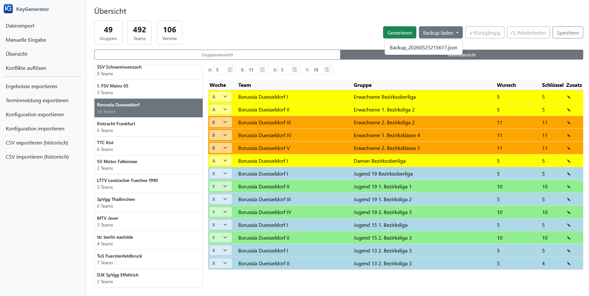

[← 6. Schlüsselzahlen generieren](06_generierung.md) | [Inhaltsverzeichnis](README.md) | [8. Typischer Arbeitsablauf →](08_arbeitsablauf.md)

---

# 7. Sonstige Funktionen

Sobald Daten geladen sind, stehen in der **Seitenleiste** folgende Exportfunktionen zur Verfügung:

| Funktion | Beschreibung |
|----------|--------------|
| Ergebnisse exportieren | Exportiert die generierten Schlüsselzahlen als CSV-Datei mit Gruppen, Mannschaften, Schlüsselzahlen, Wunsch-Schlüsselzahlen, Spielwochen und Zusatz-Vorgaben. Falls die zugewiesene Schlüsselzahl nicht in der Wunschliste enthalten ist (Konflikt), wird dies in der Spalte "Wunsch" sichtbar. |
| Terminmeldung exportieren | Exportiert eine CSV-Datei mit Spieltag (Wochentag + Uhrzeit) und Ersatzspieltag je Mannschaft. Nützlich, um die Vollständigkeit der Terminmeldung zu überprüfen. |
| Konfiguration exportieren | Exportiert die aktuelle Konfiguration als JSON-Datei. Die Konfiguration enthält Heim- und Auswärtsspieltage je Raster, die Referenzrastergrößen, die minimale/maximale Rastergröße sowie die unterstützten Altersklassen. |
| Konfiguration importieren | Importiert eine Konfiguration aus einer JSON-Datei und ersetzt damit alle oben genannten Einstellungen (Spielpläne, Referenzraster, Rastergrößen, Altersklassen). |
| CSV exportieren (historisch) | Exportiert die Daten in ein älteres CSV-Format. |
| CSV importieren (historisch) | Importiert Daten aus einem älteren CSV-Format. |

## 7.1 Backup laden

Vor jeder Generierung wird automatisch eine Sicherheitskopie des aktuellen Datenstands in der laufenden Sitzung erstellt.
Falls Sie nach der Generierung einen Fehler bemerken, können Sie den vorherigen Zustand auf der **Übersicht** wiederherstellen:

1. Klicken Sie in der Übersicht auf das Dropdown-Menü **Backup laden**.
2. Wählen Sie die gewünschte Sicherheitskopie anhand des Zeitstempels aus.
3. Der geladene Zustand wird sofort wiederhergestellt.

Das Laden eines Backups deaktiviert außerdem den Link **Konflikte auflösen** in der Seitenleiste (siehe [6.2 Konflikte auflösen](06_generierung.md#62-konflikte-aufloesen)).

> **Ansicht: Dropdown-Menü „Backup laden"**
>
> Das Dropdown-Menü "Backup laden" in der Übersicht nach einer Generierung: Es zeigt die verfügbaren Sicherheitskopien mit Zeitstempel an.
>
> 

**Hinweis:** Sicherheitskopien werden nur für die Dauer der aktuellen Browser-Sitzung gespeichert. Beim Schließen des Browser-Tabs gehen sie verloren. Um den aktuellen Stand dauerhaft zu sichern, laden Sie die Daten über den Button **Speichern** als `Data.json` herunter.

## 7.2 Ergebnisse exportieren

Nach der Generierung können Sie die Ergebnisse als CSV-Datei herunterladen, um diese in einer übersichtlichen Form anzusehen (z.B. mit Microsoft Excel) und anschließend in Click-TT zu übertragen:

1. Klicken Sie in der Seitenleiste auf **Ergebnisse exportieren**.
2. Die Datei wird direkt in den Browser-Downloads-Ordner heruntergeladen.

Die exportierte CSV-Datei enthält je Mannschaft: Gruppe, Mannschaftsname, zugewiesene Schlüsselzahl, Wunsch-Schlüsselzahlen, Spielwochen sowie Zusatzvorgaben zu Heim- und Auswärtsspieltagen.
Falls die zugewiesene Schlüsselzahl nicht in der Wunschliste enthalten ist (Konflikt), wird dies in der Spalte "Wunsch" kenntlich gemacht.

## 7.3 Terminmeldung exportieren

Mit dieser Funktion können Sie die eingegebenen Terminmeldungen zur Überprüfung exportieren:

1. Klicken Sie in der Seitenleiste auf **Terminmeldung exportieren**.
2. Die Datei wird direkt in den Browser-Downloads-Ordner heruntergeladen.

Die erzeugte CSV-Datei enthält je Mannschaft den gemeldeten Spieltag (Wochentag und Uhrzeit) sowie den Ersatzspieltag.
Sie eignet sich dazu, die Vollständigkeit der Terminmeldung zu überprüfen.
Mit der Schlüsselzahlen-Generierung im engeren Sinne hat diese Zusatzfunktion nichts zu tun.

## 7.4 Konfiguration exportieren und importieren

Die Konfiguration legt fest, welche Spielpläne (Heim-/Auswärtsspieltage je Raster), Referenzrastergrößen, minimale und maximale Rastergrößen sowie Altersklassen unterstützt werden.
Sie kann gespeichert und auf einem anderen Rechner oder in einer anderen Saison wiederverwendet werden.

**Konfiguration exportieren:**
1. Klicken Sie in der Seitenleiste auf **Konfiguration exportieren**.
2. Die Konfigurationsdatei wird als JSON-Datei in den Browser-Downloads-Ordner heruntergeladen.

**Konfiguration importieren:**
1. Klicken Sie in der Seitenleiste auf **Konfiguration importieren**.
2. Wählen Sie im Dateiauswahl-Dialog die gewünschte JSON-Konfigurationsdatei aus.

Beim Import werden alle bestehenden Einstellungen (Spielpläne, Referenzraster, Rastergrößen, Altersklassen) vollständig durch die Werte aus der importierten Datei ersetzt.
Falls die Datei ungültige Werte enthält, erscheint eine Fehlermeldung mit einer Auflistung der konkreten Verstöße (siehe auch [9. Fehlerbehebung](09_fehlerbehebung.md)).

## 7.5 CSV exportieren und importieren (historisches Format)

Für den Austausch mit älteren Versionen des Programms steht ein CSV-basiertes Datenformat zur Verfügung.

**CSV exportieren:**
1. Klicken Sie in der Seitenleiste auf **CSV exportieren (historisch)**.
2. Die Dateien werden in den Browser-Downloads-Ordner heruntergeladen.

**CSV importieren:**
1. Klicken Sie in der Seitenleiste auf **CSV importieren (historisch)**.
2. Wählen Sie im Dateiauswahl-Dialog die gewünschte CSV- oder ZIP-Datei aus.

Beachten Sie, dass dieses Format nur für die Kompatibilität mit älteren Programmversionen vorgesehen ist.
Für die normale Nutzung empfiehlt sich das JSON-basierte Speicherformat (siehe [3.3 Laden aus Datei](03_datenimport.md#33-laden-aus-datei)).

---

[← 6. Schlüsselzahlen generieren](06_generierung.md) | [Inhaltsverzeichnis](README.md) | [8. Typischer Arbeitsablauf →](08_arbeitsablauf.md)
