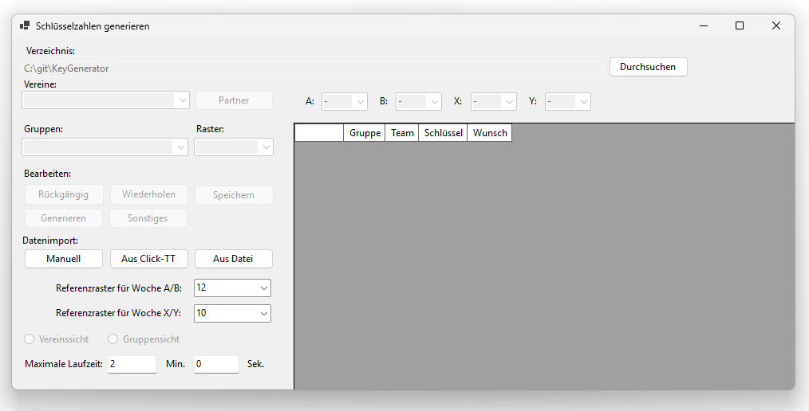

[← 2. Dateistruktur](02_dateistruktur.md) | [Inhaltsverzeichnis](README.md) | [4. Datenimport →](04_datenimport.md)

---

# 3. Vorbereitungen

Starten Sie die Anwendung `KeyGenerator.exe`.
Der Startbildschirm ist die zentrale Arbeitsfläche und wie folgt aufgebaut:

- **Oberer Bereich**: Verzeichnisauswahl und Navigationsleiste.
- **Linke Seite**: Steuerelemente für Vereins-/Gruppenauswahl, Aktionsbuttons und Einstellungen.
- **Rechte Seite**: Datentabelle zur Anzeige und Bearbeitung der Mannschaftsdaten.

Über die Radiobuttons **Vereinssicht** und **Gruppensicht** unten links wird zwischen zwei Ansichten der Datentabelle gewechselt:

- **Vereinssicht**: Zeigt alle Mannschaften eines ausgewählten Vereins gruppenübergreifend an.
- **Gruppensicht**: Zeigt alle Mannschaften einer ausgewählten Gruppe an.

Die Ansichten und ihre Tabellenspalten sind in [5. Startbildschirm](05_startbildschirm.md) im Detail beschrieben.

Die drei Hauptbuttons sind:
- **Generieren**: Startet die automatische Schlüsselzahlgenerierung (siehe [6. Schlüsselzahlen generieren](06_generierung.md)).
- **Speichern** (oder **Strg+S**): Speichert den aktuellen Stand als JSON-Datei. Falls noch kein Dateiname und Speicherort ausgewählt wurde, öffnet sich ein entsprechendes Dialogfenster.
- **Sonstiges**: Öffnet das Fenster für zusätzliche Funktionen (siehe [7. Sonstige Funktionen](07_sonstige_funktionen.md)).

> **Ansicht: Startbildschirm**
>
> Der Startbildschirm nach dem Programmstart: Links befinden sich die Datenimport-Buttons, die Referenzraster-Dropdowns, die Laufzeitbegrenzung sowie die Rückgängig/Wiederherstellen-Buttons; rechts ist die noch leere Datentabelle zu sehen.
>
> 

Bevor Sie mit dem Import oder der Eingabe von Daten beginnen können, müssen zunächst die grundlegenden Einstellungen vorgenommen werden.

## 3.1 Verzeichnis einstellen

Im oberen Bereich des Startbildschirms sehen Sie das Feld "Verzeichnis".
Hier wird der Dateipfad angezeigt, in dem die Anwendung Dateien sucht und speichert.
Standardmäßig ist das Verzeichnis auf den Speicherort der Anwendung eingestellt.

Wenn Sie ein anderes Verzeichnis verwenden möchten, klicken Sie auf den Button **Durchsuchen** rechts neben dem Textfeld.
Es öffnet sich ein Dialog, in dem Sie den gewünschten Ordner auswählen können.

## 3.2 Referenzraster einstellen

Im unteren linken Bereich des Startbildschirms befinden sich zwei Dropdown-Menüs:

- **Referenzraster für Woche A/B**: Legt die Rastergröße für die Spielwochen A und B fest.
- **Referenzraster für Woche X/Y**: Legt die Rastergröße für die Spielwochen X und Y fest.

Die möglichen Rastergrößen sind **6, 8, 10, 12** und **14**.
Die Voreinstellungen (standardmäßig 12 für A/B und 10 für X/Y) werden beim Programmstart automatisch aus der eingebetteten Konfiguration geladen.
Diese Referenzraster bestimmen, welche Schlüsselzahlen für die jeweiligen Spielwochen auf Vereinsebene maximal vergeben werden können.

**Wichtig:** Alle drei Buttons für den Datenimport (**Manuell**, **Aus Click-TT**, **Aus Datei**) werden erst aktiviert, sobald beide Referenzraster ausgewählt sind.
Da die Standardwerte aus der Konfiguration vorbelegt werden, sind die Buttons beim Start in der Regel sofort verfügbar.

Wenn Sie die Referenzraster nachträglich ändern, werden alle Vereins-Schlüsselzahlen, die den neuen Bereich überschreiten, automatisch zurückgesetzt.

> **Beispiel: Referenzraster**
>
> In unserem Beispiel sind die Referenzraster wie folgt eingestellt:
> - **Referenzraster A/B**: 12 – Die Erwachsenen-Gruppen spielen mit Rastergröße 12.
> - **Referenzraster X/Y**: 10 – Die Jugend- und Damen-Gruppen spielen mit Rastergröße 10.
>
> Das bedeutet: Auf Vereinsebene können für die Wochen A und B Schlüsselzahlen von 1 bis 12 vergeben werden, für die Wochen X und Y Schlüsselzahlen von 1 bis 10.

## 3.3 Begrenzung der Laufzeit

Da die Ermittlung der Schlüsselzahlen ein komplexes Optimierungsproblem darstellt, kann die maximale Laufzeit für die Generierung begrenzt werden.
Wenn die maximale Laufzeit erreicht ist, wird die beste bis dahin gefundene Lösung angezeigt.
Die Einstellung befindet sich unten links auf dem Startbildschirm:

- **Maximale Laufzeit**: Geben Sie die Laufzeit in Minuten und Sekunden ein.

Der Standardwert beträgt **2 Minuten 0 Sekunden**, was im Normalfall für eine gute Lösung ausreicht.
Sie können den Zeitraum verlängern, um eventuell eine noch bessere Lösung zu erhalten.
Wenn das Programm vor Ablauf der Zeit die optimale Lösung findet, wird die Suche automatisch vorzeitig beendet.

## 3.4 Rückgängig und Wiederherstellen

Manuelle Änderungen können sowohl in der Hauptansicht als auch im Dateninput-Fenster rückgängig gemacht und wiederhergestellt werden:

- **Strg+Z** oder Button **Rückgängig**: Letzte Änderung rückgängig machen.
- **Strg+Y** oder Button **Wiederherstellen**: Rückgängig gemachte Änderung wiederherstellen.

Die Änderungshistorie wird beim Laden neuer Daten sowie beim Start einer neuen Generierung automatisch zurückgesetzt.
Um auf den Stand vor der Generierung zurückzukehren, wird automatisch ein Backup angelegt (siehe [7.1 Backup laden](07_sonstige_funktionen.md#71-backup-laden)).

---

[← 2. Dateistruktur](02_dateistruktur.md) | [Inhaltsverzeichnis](README.md) | [4. Datenimport →](04_datenimport.md)
