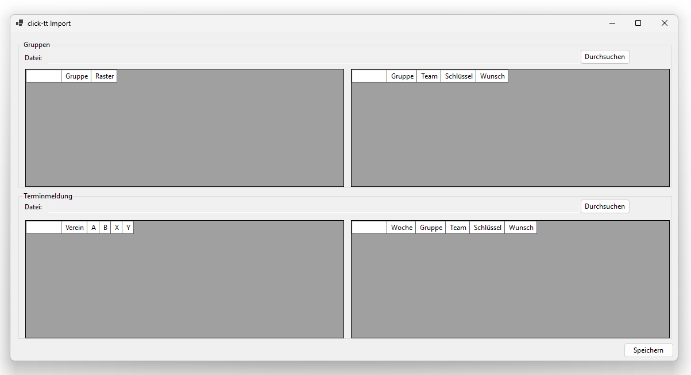
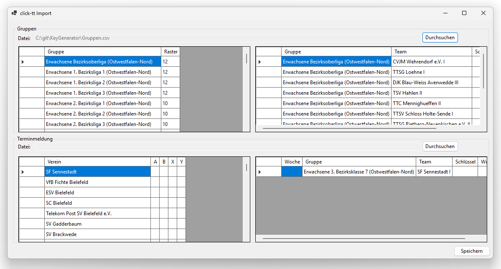
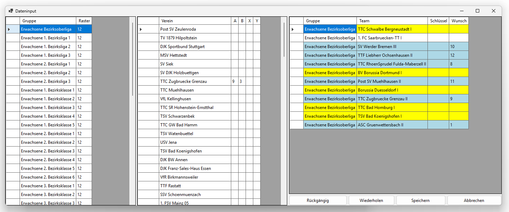
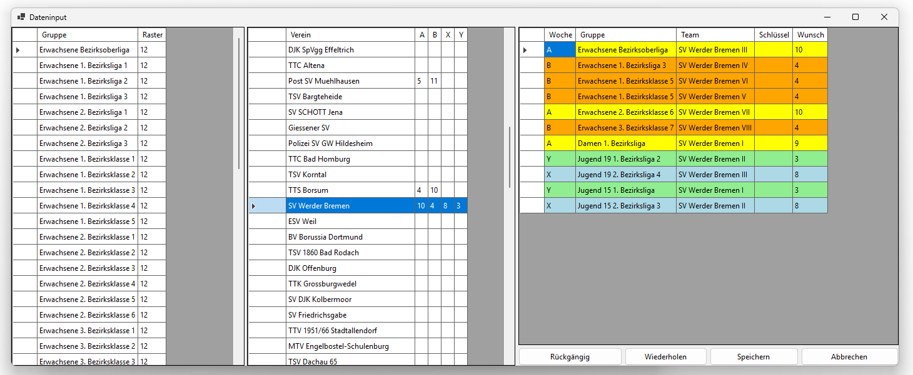

[← 3. Vorbereitungen](03_vorbereitungen.md) | [Inhaltsverzeichnis](README.md) | [5. Startbildschirm →](05_startbildschirm.md)

---

# 4. Datenimport

Der Datenimport kann auf drei Wegen erfolgen, die über die Buttons im Bereich "Datenimport" auf dem Startbildschirm erreichbar sind:

1. **Aus Click-TT** – Import aus Dateien, die aus Click-TT exportiert wurden (Abschnitt 4.1)
2. **Manuell** – Manuelle Eingabe von Vereinen, Gruppen und Mannschaften (Abschnitt 4.2)
3. **Aus Datei** – Laden einer zuvor gespeicherten JSON-Datei (Abschnitt 4.3)

Bei der ersten Verwendung empfiehlt sich der Import aus Click-TT, um sich Tipparbeit zu ersparen.
Anschließend sollten die Daten manuell kontrolliert und ergänzt werden.

## 4.1 Import aus Click-TT

Klicken Sie auf den Button **Aus Click-TT** auf dem Startbildschirm.
Es öffnet sich das Fenster "click-tt Import", das in zwei Bereiche gegliedert ist:

> **Ansicht: Fenster „click-tt Import" (leer)**
>
> Das Fenster unmittelbar nach dem Öffnen, bevor Dateien ausgewählt wurden: Oben der Bereich für den Gruppenimport (CSV-Datei), unten der Bereich für die Terminmeldung (HTML-Datei).
>
> 

### Oberer Bereich: Gruppen

Der obere Bereich ("Gruppen") dient dem Import der Gruppen und ihrer Mannschaften.

1. Klicken Sie auf den Button **Durchsuchen** rechts oben.
2. Wählen Sie eine CSV-Datei aus, die die Gruppeninformationen enthält (z.B. `Tabellen.csv`). Diese muss zuvor aus Click-TT heruntergeladen worden sein (Abschnitt [B.1](B_download_aus_click-tt.md#b1-gruppenstruktur-als-csv-datei-herunterladen)).
3. Nach dem Import erscheinen links die Gruppen und rechts die Mannschaften der jeweils ausgewählten Gruppe.
4. Die Rastergrößen der Gruppen werden automatisch anhand der Teamanzahl ermittelt, und können ggf. manuell angepasst werden (Abschnitt 4.2).

> **Ansicht: Fenster „click-tt Import" nach dem Gruppenimport**
>
> Nach dem Import der CSV-Datei erscheinen links die importierten Gruppen und rechts die Mannschaften der jeweils ausgewählten Gruppe; die Rastergröße wird automatisch anhand der Teamanzahl mit dem kleinstmöglichen Wert vorbelegt und kann entsprechend angepasst werden.
>
> 

### Unterer Bereich: Terminmeldung

Der untere Bereich ("Terminmeldung") dient dem Import der Vereinsinformationen und Spielwochenwünsche.

1. Klicken Sie auf den Button **Durchsuchen** rechts.
2. Wählen Sie eine HTML-Datei aus, die die Terminmeldungen enthält. Diese muss zuvor wie in den Abschnitten [B.2](B_download_aus_click-tt.md#b2-terminmeldung-als-pdf-datei-herunterladen) – [B.4](B_download_aus_click-tt.md#b4-terminmeldung-in-eine-html-datei-konvertieren) beschrieben erstellt worden sein. Wir hoffen, dass in naher Zukunft ein direkter Download der Terminmeldung in Click-TT zur Verfügung steht. 
3. Nach dem Import erscheinen links die Vereine und rechts die Mannschaften des jeweils ausgewählten Vereins. In den Spalten A,B,X und Y können Schlüsselzahlen basierend auf Vorgaben einer höheren Ebene eingetragen werden. 

Klicken Sie abschließend auf **Speichern**, um die Daten in eine JSON-Datei zu exportieren.
Der Button befindet sich unten rechts im Fenster.
Alternativ werden Sie beim Schließen des Fensters gefragt, ob Sie die Änderungen speichern möchten – sofern welche vorgenommen wurden.

## 4.2 Manueller Datenimport

Die manuelle Eingabe von Daten erfolgt über den Button **Manuell** auf dem Startbildschirm.
Es öffnet sich das Fenster "Dateninput", das in drei nebeneinander angeordnete Bereiche unterteilt ist: eine Gruppentabelle (links), eine Vereinstabelle (Mitte) und eine Mannschaftstabelle (rechts).

### Linke Seite: Gruppentabelle

Die linke Tabelle zeigt alle Gruppen mit folgenden Spalten:

| Spalte | Bedeutung |
|--------|-----------|
| Gruppe | Name der Gruppe |
| Raster | Rastergröße der Gruppe |

**Gruppen anlegen:**
Tragen Sie in der untersten (leeren) Zeile einen Gruppennamen ein.
Die neue Gruppe wird mit dem Standard-Referenzraster der Spielwochen A/B und dem Standardnamen "Neue Gruppe" angelegt.
Name und Rastergröße können direkt in der Tabelle bearbeitet werden.

**Gruppe auswählen:**
Klicken Sie auf eine Zeile in der Gruppentabelle, um die zugehörigen Mannschaften in der rechten Tabelle anzuzeigen (Gruppenansicht).
Die Spalte "Woche" ist in diesem Modus ausgeblendet; der Teamname ist direkt bearbeitbar.

**Gruppen löschen:**
Markieren Sie die Zeile der zu löschenden Gruppe und drücken Sie die Entfernen-Taste.
Eine Gruppe kann nur gelöscht werden, wenn sie keine Mannschaften mehr enthält; andernfalls erscheint eine Fehlermeldung.

> **Ansicht: Dateninput – Gruppenansicht**
>
> Das Dateninput-Fenster in der Gruppenansicht: Links die Gruppen mit Rastergrößen, in der Mitte die Vereine, rechts die Mannschaften der ausgewählten Gruppe. Die Spielwochenspalte ist in dieser Ansicht ausgeblendet.
>
> 

### Mittlere Seite: Vereinstabelle

Die mittlere Tabelle zeigt alle Vereine mit folgenden Spalten:

| Spalte | Bedeutung |
|--------|-----------|
| Verein | Name des Vereins |
| A | Schlüsselzahl für Spielwoche A (Referenzraster A/B) |
| B | Schlüsselzahl für Spielwoche B (automatisch berechnet) |
| X | Schlüsselzahl für Spielwoche X (Referenzraster X/Y) |
| Y | Schlüsselzahl für Spielwoche Y (automatisch berechnet) |

**Vereine anlegen:**
Tragen Sie in die unterste (leere) Zeile der Spalte "Verein" den Namen eines neuen Vereins ein.
Umlaute werden dabei automatisch ersetzt.
Legen Sie zunächst alle Vereine an, bevor Sie mit der Zuordnung von Mannschaften zu den Gruppen beginnen.

**Verein auswählen:**
Klicken Sie auf eine Zeile in der Vereinstabelle, um die zugehörigen Mannschaften in der rechten Tabelle anzuzeigen (Vereinsansicht).
Die Spalte "Woche" ist in diesem Modus sichtbar und bearbeitbar; der Teamname ist ebenfalls bearbeitbar.

**Vorgegebene Schlüsselzahlen einstellen:**
Wenn vom Verband oder Bezirk bereits Schlüsselzahlen für bestimmte Vereine vorgegeben sind, tragen Sie diese in der entsprechenden Spalte (A, B, X oder Y) ein.
Die gegenläufige Schlüsselzahl (also B zu A, Y zu X usw.) wird automatisch berechnet.
Es können nur Zahlen eingetragen werden, die für das eingestellte Referenzraster gültig sind.

**Vereine umbenennen:**
Ändern Sie den Vereinsnamen in der Vereinstabelle.
Die Umbenennung wird automatisch auf die Teamnamen aller Mannschaften des Vereins übertragen.

**Vereine löschen:**
Markieren Sie die Zeile des zu löschenden Vereins und drücken Sie die Entfernen-Taste.
Ein Verein kann nur gelöscht werden, wenn keine seiner Mannschaften noch einer Gruppe zugeordnet ist; andernfalls erscheint eine Fehlermeldung mit den betroffenen Gruppen.

> **Beispiel: Vorgegebene Schlüsselzahlen**
>
> Vor der Generierung hatten einige Vereine der Bezirksoberliga bereits vorgegebene Schlüsselzahlen (z.B. vom DTTB oder Verband).
> Der folgende Screenshot zeigt einen Auszug aus der Vereinsansicht:
>
> 
>
> Für den SV Werder Bremen sind Schlüsselzahlen für alle vier Wochen vorgegeben.
> Einige Vereine wie TTS Borsum haben Vorgaben nur für `A`/`B`.
> Andere Vereine wie Borussia Düsseldorf und BV Borussia Dortmund hatten zum Zeitpunkt vor der Generierung noch keine Schlüsselzahlen – diese werden dann vollständig vom Tool ermittelt.
> Die Spalte `B` wird jeweils automatisch aus `A` berechnet (und `Y` aus `X`).

### Rechte Seite: Mannschaftstabelle

Die rechte Tabelle zeigt Mannschaftsdaten in zwei alternativen Anzeigemodi:

- **Gruppenansicht**: Wird aktiviert durch Klick auf eine Zeile in der **Gruppentabelle** (links). Zeigt alle Mannschaften der ausgewählten Gruppe. Die Spalte "Woche" ist ausgeblendet. Der Teamname (Spalte "Team") ist direkt bearbeitbar.
- **Vereinsansicht**: Wird aktiviert durch Klick auf eine Zeile in der **Vereinstabelle** (Mitte). Zeigt alle Mannschaften des ausgewählten Vereins gruppenübergreifend. Die Spalte "Woche" ist sichtbar und bearbeitbar (`A`, `B`, `X`, `Y` oder leer für keine Zuordnung). Der Teamname ist in diesem Modus nicht bearbeitbar.

Die Spalten der Tabelle entsprechen denen der Hauptansicht (Woche, Gruppe, Team, Schlüssel, Wunsch). Die Spalten Gruppe, Schlüssel und Wunsch sind stets nur zur Anzeige.

Ein **Rechtsklick** auf eine Mannschaft in der Tabelle öffnet den Zusatz-Dialog (siehe [5.3 Zusätzliche Einstellungen für einzelne Teams](05_startbildschirm.md#53-zusaetzliche-einstellungen-fuer-einzelne-teams)), in dem feste Vorgaben für Heim- und Auswärtsspiele in bestimmten Spielwochen eingetragen werden können.

**Mannschaften anlegen:**
Wählen Sie zunächst in der Gruppentabelle (links) die gewünschte Gruppe aus.
**Doppelklicken** Sie anschließend in der Vereinstabelle (Mitte) auf den Vereinsnamen.
Die Mannschaft wird der Gruppe hinzugefügt, sofern noch Platz vorhanden ist (Rastergröße nicht überschritten).

**Mannschaften umbenennen:**
Der Teamname kann in der Gruppenansicht direkt in der Mannschaftstabelle bearbeitet werden.
Dabei muss der Name weiterhin mit dem Vereinsnamen beginnen (z.B. "Borussia Düsseldorf II").
Ungültige Eingaben werden automatisch zurückgesetzt.

**Mannschaften löschen:**
Wählen Sie die zu entfernende Mannschaft in der Tabelle aus und drücken Sie die Entfernen-Taste.

**Speichern:**
Das Fenster "Dateninput" besitzt einen **Speichern**-Button (oder **Strg+S**) sowie einen **Abbrechen**-Button.
Beim Schließen des Fensters (über Abbrechen oder das Schließen-Symbol) werden Sie gefragt, ob die Änderungen gespeichert werden sollen – sofern Änderungen vorgenommen wurden.
Wurden keine Änderungen vorgenommen, schließt das Fenster ohne Rückfrage.

## 4.3 Laden aus Datei

Wenn Sie bereits zu einem früheren Zeitpunkt Daten gespeichert haben, können Sie diese über den Button **Aus Datei** laden.
Es öffnet sich ein Dateiauswahldialog, in dem Sie eine JSON-Datei auswählen können (z.B. `Data.json`).
Nach dem Laden werden alle Vereine, Gruppen und Mannschaften in der Anwendung wiederhergestellt.

---

[← 3. Vorbereitungen](03_vorbereitungen.md) | [Inhaltsverzeichnis](README.md) | [5. Startbildschirm →](05_startbildschirm.md)
