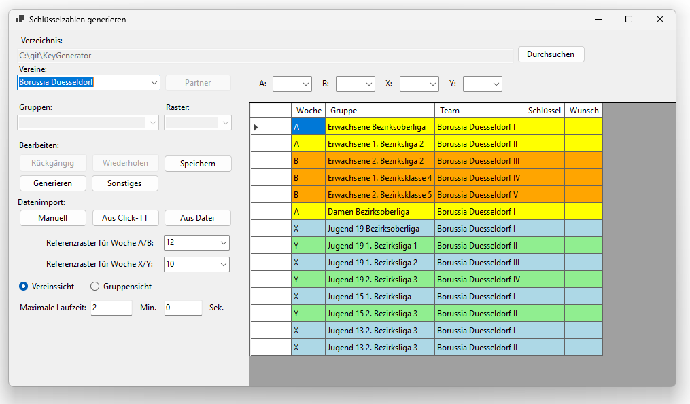
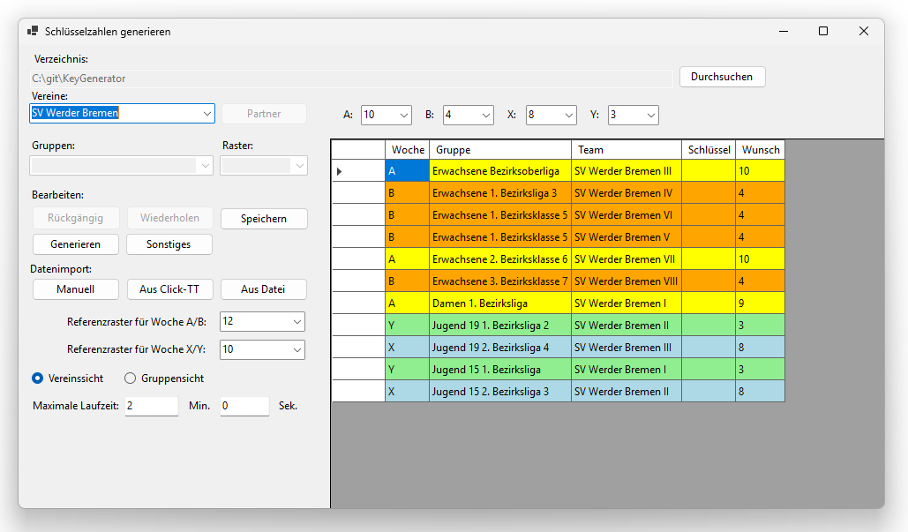
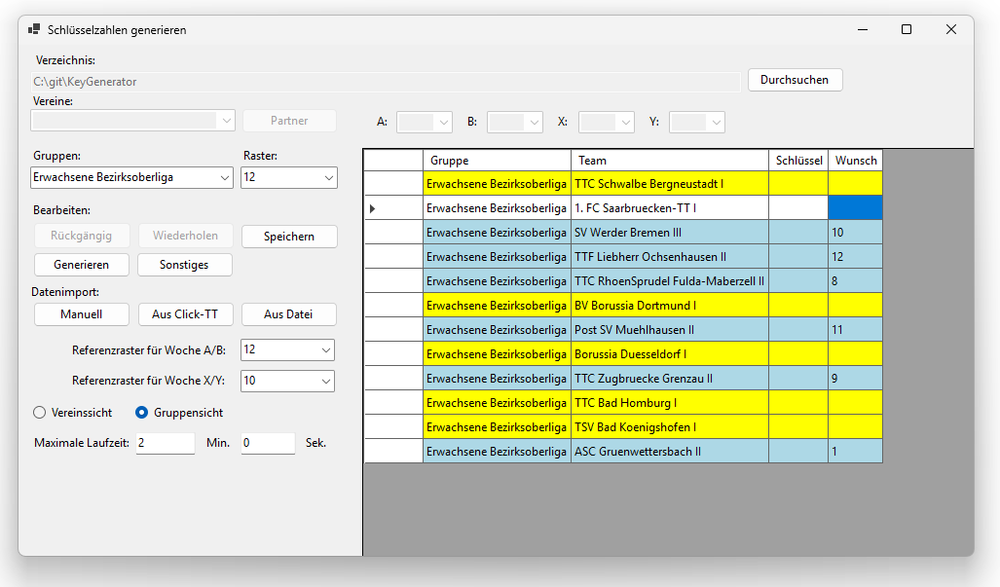
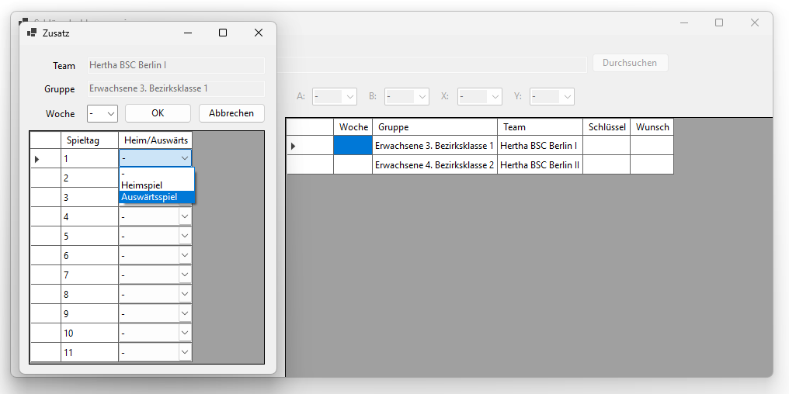

[← 4. Datenimport](04_datenimport.md) | [Inhaltsverzeichnis](README.md) | [6. Schlüsselzahlen generieren →](06_generierung.md)

---

# 5. Startbildschirm

Die folgenden Abschnitte beschreiben die beiden Ansichten der Datentabelle sowie die Möglichkeit, zusätzliche Einstellungen für einzelne Teams vorzunehmen.

## 5.1 Vereinssicht

In der Vereinssicht wählen Sie im Dropdown-Menü "Vereine" einen Verein aus.
Daraufhin werden alle Mannschaften dieses Vereins in der Tabelle rechts angezeigt.
Die Spielwoche kann bearbeitet werden, alle anderen Spalten sind nur zur Anzeige vorhanden.

### Tabellenspalten

| Spalte | Bedeutung |
|--------|-----------|
| Woche | Zugeordnete Spielwoche (A, B, X, Y oder leer). Bearbeitung: Klicken Sie in die Zelle und geben Sie die gewünschte Woche ein. |
| Gruppe | Name der Gruppe, in der die Mannschaft spielt |
| Team | Name der Mannschaft |
| Schlüssel | Zugewiesene Schlüsselzahl nach der Generierung |
| Wunsch | Mögliche Schlüsselzahlen basierend auf der Spielwochenvorgabe des Vereins |

### Farbcodierung in der Vereinssicht

Die Zeilen werden je nach Spielwoche farblich hervorgehoben:

| Spielwoche | Farbe | Bedeutung |
|------------|-------|-----------|
| A | Gelb | Spielwoche A |
| B | Orange | Spielwoche B |
| X | Blau | Spielwoche X |
| Y | Grün | Spielwoche Y |
| – | Weiß | Keine Spielwoche zugeordnet |

### Schlüsselzahlen auf Vereinsebene

Oberhalb der Tabelle befinden sich vier Dropdown-Menüs (`A`, `B`, `X`, `Y`).
Hier können Sie die Schlüsselzahlen auf Vereinsebene einstellen (deutlich komfortabler geht dies über das Fenster zur manuellen Dateneingabe, Abschnitt [4.2 Manueller Datenimport](04_datenimport.md#mittlere-seite-vereinstabelle)).
Die Werte A und B bzw. X und Y sind jeweils aneinander gekoppelt: Wenn Sie eine Schlüsselzahl für A eingeben, wird die entgegengesetzte Schlüsselzahl für B automatisch berechnet (und umgekehrt).

### Spielwochenzuordnung

Um einem Team eine Spielwoche zuzuordnen, klicken Sie in der Spalte "Woche" in die entsprechende Zeile und geben Sie den Buchstaben der Spielwoche ein (`A`, `B`, `X`, `Y`).
Um die Zuordnung zu entfernen, geben Sie `-` ein oder lassen das Feld leer.
Groß- und Kleinschreibung wird toleriert.

> **Beispiel: Vereinssicht ohne Schlüsselzahlen-Vorgabe**
>
> Der folgende Screenshot zeigt alle Mannschaften von Borussia Düsseldorf mit entsprechender farblicher Codierung für die Spielwoche.
> Vor der Generierung sind sowohl die Spalte "Schlüssel" als auch die Spalte "Wunsch" leer, da der Verein keine Schlüsselzahlenvorgabe von einer höheren Gliederungsebene hat:
>
> 

> **Beispiel: Vereinssicht mit Schlüsselzahlen-Vorgabe**
>
> Der folgende Screenshot zeigt die Mannschaften von SV Werder Bremen. Oberhalb der Tabelle sind die Dropdown-Menüs A, B, X und Y zu sehen, in denen die Vorgabewerte eingestellt sind. Die Zeilen sind entsprechend ihrer Spielwoche farblich hervorgehoben. Die Spalte "Schlüssel" ist auch bei diesem Verein leer, die Spalte "Wunsch" blendet die Schlüsselzahl(en) vor, die bei der entsprechenden Spielwoche benötigt werden.
>
> 

## 5.2 Gruppensicht

Die Gruppensicht gibt einen Überblick über alle Teams einer Gruppe.
Wählen Sie dazu im Dropdown-Menü "Gruppen" die gewünschte Gruppe aus.

Neben dem Dropdown-Menü erscheint das Feld **Raster**, in dem die Rastergröße der Gruppe angezeigt und geändert werden kann (eine komfortablere Alternative bietet dafür die manuelle Dateneingabe, Abschnitt [4.2 Manueller Datenimport](04_datenimport.md#linke-seite-gruppentabelle)).
Die Rastergröße muss mindestens so groß sein wie die Anzahl der Mannschaften in der Gruppe (aufgerundet auf eine gerade Zahl) und darf maximal 14 betragen.

### Tabellenspalten in der Gruppensicht

Die Tabelle zeigt folgende Spalten (die Spalte "Woche" ist in der Gruppensicht *nicht* sichtbar), wobei alle Spalten nur zur Anzeige verfügbar sind:

| Spalte | Bedeutung |
|--------|-----------|
| Gruppe | Name der Gruppe |
| Team | Name der Mannschaft |
| Schlüssel | Zugewiesene oder vorgegebene Schlüsselzahl |
| Wunsch | Benötigte Schlüsselzahl(en) |

### Farbcodierung in der Gruppensicht

In der Gruppensicht werden die Zeilen nach dem Zuweisungsstatus eingefärbt:

| Farbe | Bedeutung |
|-------|-----------|
| Grün | Gültige Schlüsselzahl zugewiesen, die den Wunsch-Schlüsselzahlen entspricht und in der Gruppe eindeutig ist |
| Blau | Team hat eine Spielwoche und Wunsch-Schlüsselzahlen (Vorgabe durch höhere Ebene), aber noch keine zugewiesene Schlüsselzahl |
| Gelb | Team hat eine Spielwochen-Vorgabe, der Verein hat aber keine Schlüsselzahlen-Vorgabe durch eine höhere Ebene; *oder*: Team hat keine Spielwochen-Vorgabe, aber Vorgaben für Heim- oder Auswärtsspiele |
| Orange | Schlüsselzahl stimmt nicht mit den Wunsch-Schlüsselzahlen überein; *oder*: die zugewiesene Schlüsselzahl ist in der Gruppe doppelt vergeben (ungelöster Konflikt) |
| Weiß | Team hat keine Spielwoche und keine sonstigen Vorgaben |

Die Gruppensicht eignet sich besonders zur **Kontrolle nach der Generierung**, da hier auf einen Blick alle Schlüsselzahlen einer Gruppe sichtbar sind.
Orange eingefärbte Zeilen weisen auf Konflikte hin, die auch im Nachgang über **Sonstiges** → **Konflikte neu auflösen** (siehe [7.4 Konflikte neu auflösen](07_sonstige_funktionen.md#74-konflikte-neu-aufloesen)) behoben werden können.

> **Beispiel: Gruppensicht – Bezirksoberliga Erwachsene vor der Generierung**
>
> Der folgende Screenshot zeigt die Bezirksoberliga Erwachsene (Rastergröße 12, 12 Teams) im Zustand *vor* der Generierung.
> Zu diesem Zeitpunkt waren viele Spielwochen bereits zugeordnet, aber die Schlüsselzahlen noch nicht vergeben:
>
> 
>
> Hier sind drei Farben zu erkennen:
> - **Blau**: Teams, deren Verein bereits eine vorgegebene Schlüsselzahl hat (z.B. SV Werder Bremen mit A=10). Die Wunsch-Schlüsselzahlen können berechnet werden, aber die Mannschafts-Schlüsselzahl fehlt noch.
> - **Gelb**: Teams, deren Verein noch keine Schlüsselzahl hat (z.B. Borussia Düsseldorf, BV Borussia Dortmund). Es können weder Wunsch noch Schlüsselzahl angezeigt werden.
> - **Weiß**: 1. FC Saarbrücken-TT I hat keine Spielwoche (Woche = `-`) und somit auch keine Wunsch-Schlüsselzahl.

## 5.3 Zusätzliche Einstellungen für einzelne Teams

Mit einem **Rechtsklick** auf eine Mannschaft in der Tabelle (sowohl in der Vereins- als auch in der Gruppensicht) öffnet sich das Fenster "Zusatz".
Hier können Sie folgende Einstellungen vornehmen:

### Spielwoche festlegen

Im Dropdown-Menü "Woche" können Sie die Spielwoche des Teams auswählen (`-`, `A`, `B`, `X`, `Y`).
Die Einstellung kann genauso über die Vereinssicht auf dem Startbildschirm (Abschnitt 5.1) oder über die manuelle Dateneingabe (Abschnitt [Rechte Seite: Mannschaftstabelle](04_datenimport.md#rechte-seite-mannschaftstabelle)) vorgenommen werden.

### Heim- und Auswärtsspieltage festlegen

Unterhalb der Spielwochenauswahl befindet sich eine Tabelle mit zwei Spalten:

| Spalte | Bedeutung |
|--------|-----------|
| Spieltag | Nummer des Spieltags (1, 2, 3, …) |
| Heim/Auswärts | Dropdown-Menü mit den Optionen `-` (keine Vorgabe), `Heimspiel` oder `Auswärtsspiel` |

Die Anzahl der angezeigten Spieltage wird dynamisch anhand der Rastergröße der Gruppe bestimmt.
Bei einer Gruppe mit Rastergröße 12 werden beispielsweise 11 Spieltage angezeigt, bei Rastergröße 10 entsprechend 9.

Bestätigen Sie Ihre Eingaben mit **OK** oder verwerfen Sie sie mit **Abbrechen**.

**Hinweis:** Verwenden Sie diese Funktion sparsam, da sie die Schlüsselzahlfindung erheblich erschwert und unter Umständen eine gute Lösung verhindern kann.

> **Ansicht: Fenster „Zusatz"**
>
> Das Fenster „Zusatz" mit der Spielwochenauswahl oben und der Tabelle für Heim-/Auswärtsvorgaben je Spieltag darunter. Die Anzahl der Spieltage richtet sich nach der Rastergröße der Gruppe.
>
> 

---

[← 4. Datenimport](04_datenimport.md) | [Inhaltsverzeichnis](README.md) | [6. Schlüsselzahlen generieren →](06_generierung.md)
