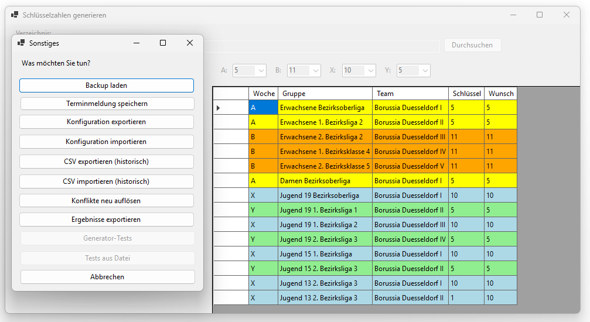

[← 6. Schlüsselzahlen generieren](06_generierung.md) | [Inhaltsverzeichnis](README.md) | [8. Typischer Arbeitsablauf →](08_arbeitsablauf.md)

---

# 7. Sonstige Funktionen

Über den Button **Sonstiges** auf dem Startbildschirm öffnet sich ein Fenster mit weiteren Funktionen:

| Funktion | Beschreibung |
|----------|--------------|
| Backup laden | Lädt eine zuvor gespeicherte Sicherheitskopie (z.B. den Stand vor der letzten Generierung). Siehe Abschnitt 7.1. |
| Terminmeldung speichern | Exportiert eine CSV-Datei mit Spieltag (Wochentag + Uhrzeit) und Ersatzspieltag je Mannschaft. Nützlich, um die Vollständigkeit der Terminmeldung zu überprüfen. |
| Konfiguration exportieren | Exportiert die aktuelle Konfiguration an einen gewählten Speicherort. Die Konfiguration enthält Heim- und Auswärtsspieltage je Raster, die aktuell eingestellten Referenzraster (als Voreinstellung für neue Daten), die minimale/maximale Rastergröße, die unterstützten Altersklassen, die Anzahl der bevorzugten internen Spielwochen sowie die maximal tolerierte Abweichung bei ähnlichen Schlüsselzahlen. |
| Konfiguration importieren | Importiert eine Konfiguration aus einer JSON-Datei und ersetzt damit alle oben genannten Einstellungen (Spielpläne, Voreinstellungen der Referenzraster, Rastergrößen, Altersklassen, interne Spielwochen, max. Abweichung). Die Referenzraster bereits geladener Daten bleiben erhalten. |
| CSV exportieren (histor.) | Exportiert die Daten in ein älteres CSV-Format. |
| CSV importieren (histor.) | Importiert Daten aus einem älteren CSV-Format. |
| Konflikte neu auflösen | Erkennt Konflikte, die sich aus Spielplan-Einschränkungen (Heim-/Auswärts- und Spielfreivorgaben) ergeben, und ermöglicht deren Auflösung. Bestehende Schlüsselzahlzuweisungen bleiben dabei erhalten. |
| Alle Schlüssel löschen | Löscht alle zugewiesenen Mannschafts- und Vereins-Schlüsselzahlen. Diese Aktion kann über **Rückgängig** rückgängig gemacht werden. Siehe Abschnitt 7.7. |
| Ergebnisse exportieren | Exportiert die generierten Schlüsselzahlen als CSV-Datei mit Gruppen, Mannschaften, Schlüsselzahlen, Wunsch-Schlüsselzahlen, Spielwochen und Zusatz-Vorgaben. Falls die zugewiesene Schlüsselzahl nicht in der Wunschliste enthalten ist (Konflikt), wird dies in der Spalte "Wunsch" sichtbar. |
| Generator-Tests | Startet automatisierte Tests des Generierungsalgorithmus (für die normale Anwendung nicht notwendig). |
| Tests aus Datei | Führt Tests aus einer Datei aus (für die normale Anwendung nicht notwendig). |
| Abbrechen | Schließt das Fenster und kehrt zum Startbildschirm zurück. |

> **Ansicht: Fenster „Sonstiges"**
>
> Das Fenster „Sonstiges" mit der Auflistung aller Zusatzfunktionen, erreichbar über den gleichnamigen Button auf dem Startbildschirm.
>
> 

## 7.1 Backup laden

Vor jeder Generierung wird automatisch eine Sicherheitskopie des aktuellen Datenstands erstellt.
Falls Sie nach der Generierung einen Fehler bemerken, können Sie den vorherigen Zustand wiederherstellen:

1. Klicken Sie auf **Sonstiges** im Startbildschirm.
2. Klicken Sie auf **Backup laden**.
3. Es öffnet sich ein Dateidialog, der automatisch den Unterordner `Backup` im eingestellten Verzeichnis vorauswählt. Wählen Sie dort die gewünschte Sicherheitskopie (JSON-Datei) aus.
4. Der geladene Zustand wird sofort wieder abgespeichert.

## 7.2 Ergebnisse exportieren

Nach der Generierung können Sie die Ergebnisse als CSV-Datei speichern, um die Ergebnisse in einer übersichtlichen Form ansehen (z.B. mit Microsoft Excel) und anschließend in Click-TT übertragen zu können:

1. Klicken Sie auf **Sonstiges** im Startbildschirm.
2. Klicken Sie auf **Ergebnisse exportieren**.
3. Wählen Sie im Dateidialog den gewünschten Speicherort und Dateinamen.

Die exportierte CSV-Datei enthält je Mannschaft: Gruppe, Mannschaftsname, zugewiesene Schlüsselzahl, Wunsch-Schlüsselzahlen, Spielwochen sowie Zusatzvorgaben zu Heim- und Auswärtsspieltagen.
Falls die zugewiesene Schlüsselzahl nicht in der Wunschliste enthalten ist (Konflikt), wird dies in der Spalte "Wunsch" kenntlich gemacht.

## 7.3 Terminmeldung speichern

Mit dieser Funktion können Sie die eingegebenen Terminmeldungen zur Überprüfung exportieren:

1. Klicken Sie auf **Sonstiges** im Startbildschirm.
2. Klicken Sie auf **Terminmeldung speichern**.
3. Wählen Sie im Dateidialog den gewünschten Speicherort und Dateinamen.

Die erzeugte CSV-Datei enthält je Mannschaft den gemeldeten Spieltag (Wochentag und Uhrzeit) sowie den Ersatzspieltag.
Sie eignet sich dazu, die Vollständigkeit der Terminmeldung zu überprüfen. 
Mit der Schlüsselzahlen-Generierung im engeren Sinne hat diese Zusatzfunktion nichts zu tun.

## 7.4 Konflikte neu auflösen

Diese Funktion ermöglicht es, nach einer erfolgten Generierung Konflikte erneut zu erkennen und zu beheben, die sich aus den Spielplan-Einschränkungen ergeben (Heim-/Auswärtsspielvorgaben sowie Spielfreiwünsche):

1. Klicken Sie auf **Sonstiges** im Startbildschirm.
2. Klicken Sie auf **Konflikte neu auflösen**.
3. Es erscheint ein Dialogfenster zur Auflösung von Konflikten (siehe [6.1 Konflikte beheben](06_generierung.md#61-konflikte-beheben))

Im Gegensatz zu einer vollständigen Neu-Generierung bleiben dabei die bereits vorgenommenen Schlüsselzahlzuweisungen erhalten.
Nur die erkannten Konflikte bezüglich der Spielplan-Einschränkungen werden zur Auflösung angeboten.

## 7.5 Konfiguration exportieren und importieren

Die Konfiguration legt fest, welche Spielpläne (Heim-/Auswärtsspieltage je Raster), Voreinstellungen der Referenzraster für neue Daten, minimale und maximale Rastergrößen sowie Altersklassen unterstützt werden. Sie enthält außerdem die Anzahl der Spielwochen, in denen interne Begegnungen bevorzugt werden sollen (`internalWeeks`, Standard: 3), sowie die maximale Schrittweite, innerhalb derer eine Schlüsselzahl noch als „ähnlich" gilt (`maxDeviation`, Standard: 2).
Sie kann gespeichert und auf einem anderen Rechner oder in einer anderen Saison wiederverwendet werden.

**Konfiguration exportieren:**
1. Klicken Sie auf **Sonstiges** im Startbildschirm.
2. Klicken Sie auf **Konfiguration exportieren**.
3. Wählen Sie im Dateidialog den gewünschten Speicherort und Dateinamen. Die Konfiguration wird als JSON-Datei gespeichert.
Als Voreinstellung der Referenzraster enthält die exportierte Datei die aktuell eingestellten Referenzraster. Um die Voreinstellungen für neue Daten zu ändern, stellen Sie also die gewünschten Referenzraster ein, exportieren die Konfiguration und importieren sie anschließend wieder.

**Konfiguration importieren:**
1. Klicken Sie auf **Sonstiges** im Startbildschirm.
2. Klicken Sie auf **Konfiguration importieren**.
3. Wählen Sie im Dateidialog die gewünschte JSON-Konfigurationsdatei aus.

Beim Import werden alle bestehenden Einstellungen (Spielpläne, Voreinstellungen der Referenzraster, Rastergrößen, Altersklassen) vollständig durch die Werte aus der importierten Datei ersetzt.
Die Referenzraster bereits geladener Daten bleiben dabei erhalten. Nur wenn die neue Konfiguration für eines davon keinen Spielplan enthält, gilt ihre Voreinstellung; Schlüsselzahlen-Paare außerhalb des neuen Bereichs werden dann zurückgesetzt, und eine Meldung nennt die betroffenen Vereine.
Falls die Datei ungültige Werte enthält, erscheint eine Fehlermeldung mit einer Auflistung der konkreten Verstöße (siehe auch [9. Fehlerbehebung](09_fehlerbehebung.md)).

## 7.6 CSV exportieren und importieren (historisches Format)

Für den Austausch mit älteren Versionen des Programms steht ein CSV-basiertes Datenformat zur Verfügung.

**CSV exportieren:**
1. Klicken Sie auf **Sonstiges** im Startbildschirm.
2. Klicken Sie auf **CSV exportieren (histor.)**.
3. Wählen Sie im Verzeichnisdialog den gewünschten Speicherort aus.

**CSV importieren:**
1. Klicken Sie auf **Sonstiges** im Startbildschirm.
2. Klicken Sie auf **CSV importieren (histor.)**.
3. Wählen Sie im Verzeichnisdialog den Speicherort der jeweiligen CSV-Dateien aus.

Beachten Sie, dass dieses Format nur für die Kompatibilität mit älteren Programmversionen vorgesehen ist.
Es enthält keine Referenzraster; beim Import gelten die Voreinstellungen der Konfiguration.
Für die normale Nutzung empfiehlt sich das JSON-basierte Speicherformat (siehe [4.3 Laden aus Datei](04_datenimport.md#43-laden-aus-datei)).

## 7.7 Alle Schlüssel löschen

Mit dieser Funktion werden alle zugewiesenen Mannschafts- und Vereins-Schlüsselzahlen auf einmal entfernt:

1. Klicken Sie auf **Sonstiges** im Startbildschirm.
2. Klicken Sie auf **Alle Schlüssel löschen**.
3. Es erscheint eine Sicherheitsabfrage. Bestätigen Sie die Aktion.

Die Löschung kann über **Strg+Z** (Rückgängig) jederzeit rückgängig gemacht werden.

---

[← 6. Schlüsselzahlen generieren](06_generierung.md) | [Inhaltsverzeichnis](README.md) | [8. Typischer Arbeitsablauf →](08_arbeitsablauf.md)
