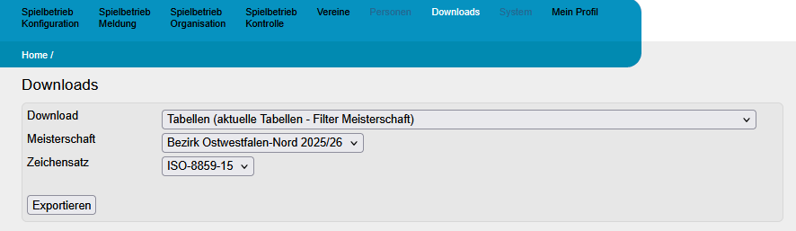
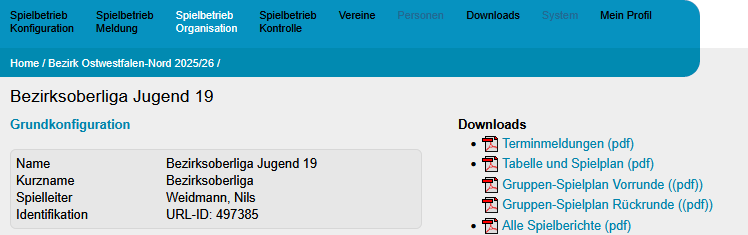
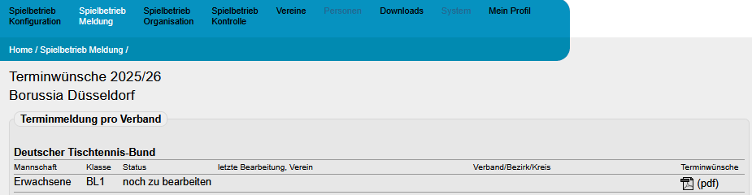
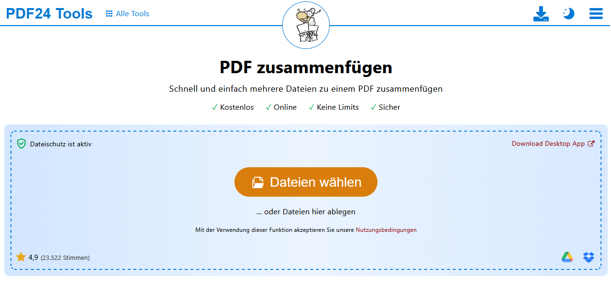
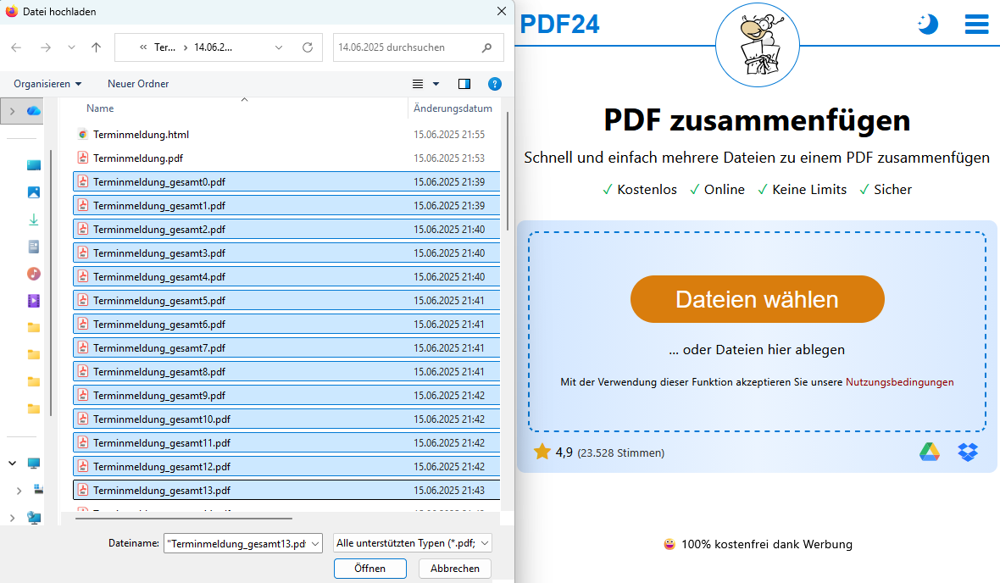
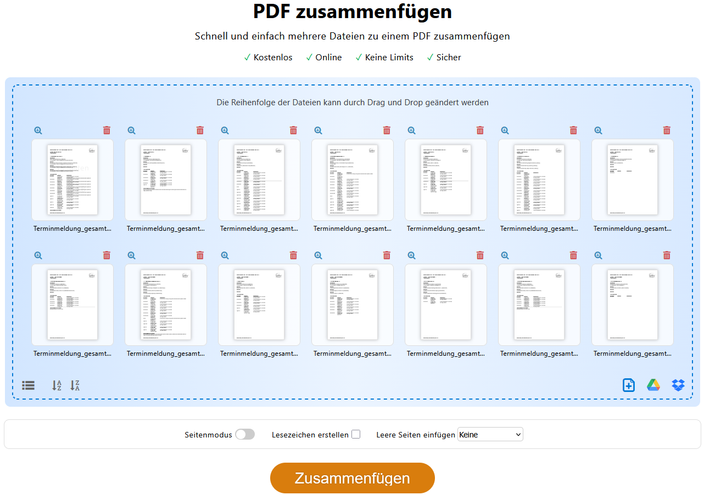
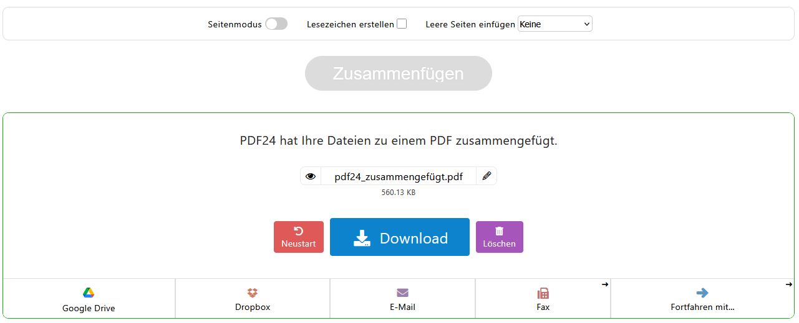
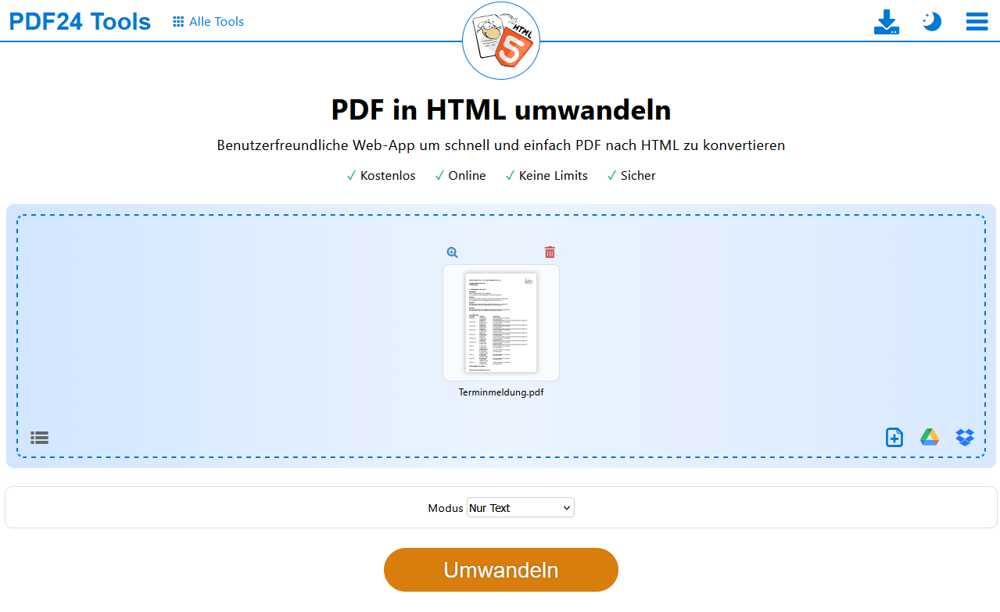
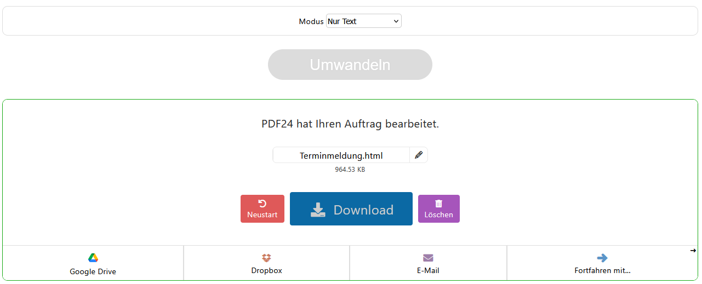

[← A. Datenmodell](A_datenmodell.md) | [Inhaltsverzeichnis](README.md)

---

# Anhang B: Download aus Click-TT

In diesem Abschnitt wird vorgestellt, wie die relevanten Dateien für Gruppeneinteilung und Terminmeldung aus Click-TT heruntergeladen, bzw. in das erwartete Format umgewandelt werden können.

## B.1 Gruppenstruktur als CSV-Datei herunterladen

Melden Sie sich bei Click-TT an und navigieren Sie zum Download-Bereich.
Wählen Sie im obersten Dropdown-Menü "Tabellen (aktuelle Tabellen - Filter Meisterschaft) aus. 

Laden Sie die Gruppenstruktur über den entsprechenden Button "Exportieren" als CSV-Datei herunter (z.B. `Tabellen.csv`).

Die heruntergeladene Datei kann anschließend in Abschnitt [4.1 Import aus Click-TT](04_datenimport.md#41-import-aus-click-tt) in den KeyGenerator importiert werden.
Der KeyGenerator extrahiert aus dieser Datei lediglich die Gruppeneinteilung, die Tabellenstände werden ignoriert.

## B.2 Terminmeldung als PDF-Datei herunterladen

Der Download der Terminmeldung im PDF-Format erfordert zum jetzigen Zeitpunkt einige manuelle Schritte.
Wir hoffen, dass in naher Zukunft ein Download der Terminmeldung als CSV-Datei (wie für die Gruppeneinteilung, siehe Abschnitt B.1) zur Verfügung steht.
Die Terminmeldung kann auf zwei verschiedenen Wegen heruntergeladen werden:

**Variante A**: Navigieren Sie in Click-TT über "Spielbetrieb Organisation" zu einer Gruppe ihrer Gliederung.
Laden Sie auf der rechten Seite unter "Downloads" die oberste PDF-Datei (Terminmeldungen (pdf)) herunter.
Wiederholen Sie diesen Schritt für jede Gruppe Ihrer Gliederung.   

**Variante B**: Öffnen Sie über "Spielbetrieb Meldung" die Terminmeldung eines Vereins und laden Sie diese als PDF herunter (Spalte Terminwünsche). 
Wiederholen Sie diesen Schritt für jeden Verein Ihrer Gliederung.

Die einzelnen PDF-Dateien werden im nächsten Schritt zu einer gemeinsamen PDF zusammengeführt.

## B.3 Terminmeldung in eine PDF-Datei zusammenführen

Öffnen Sie das Online-Werkzeug [PDF24 – PDF zusammenfügen](https://tools.pdf24.org/de/pdf-zusammenfuegen).
Klicken Sie auf "Dateien wählen".

Fügen Sie alle heruntergeladenen Terminmeldungs-PDFs hinzu.
Wenn Sie alle PDF-Dateien in einem Ordner abgelegt haben, können Sie mithilfe der Tastenkombination STRG+A alle Dateien gleichzeitig auswählen und gemeinsam hinzufügen.
Die Reihenfolge ist dabei unerheblich.

Nachdem Sie "Öffnen" angeklickt und die Dateien hochgeladen haben, sollten die Dokumente in einer Miniaturansicht sichtbar sein. Klicken Sie anschließend auf **Zusammenfügen**:

Nach einigen Sekunden erscheint im unteren Bereich eine Textmeldung, dass PDF24 die Dateien zu einem einzigen PDF-Dokument zusammengefügt hat.
Sie können dieses Dokument zunächst umbenennen (z.B. in "Terminmeldung.pdf"), und anschließend über den Download-Button herunterladen.

## B.4 Terminmeldung in eine HTML-Datei konvertieren

Öffnen Sie das Online-Werkzeug [PDF24 – PDF in HTML](https://tools.pdf24.org/de/pdf-in-html) und laden Sie die im vorherigen Schritt erstellte PDF-Datei hoch.

**Wichtig**: Als Modus muss im Dropdown-Menü "Nur Text" ausgewählt werden, damit der KeyGenerator die HTML-Datei anschließend korrekt einlesen kann.

Klicken Sie anschließend auf "Umwandeln".

Nach einigen Sekunden erscheint im unteren Bereich eine Textmeldung, dass PDF24 die PDF-Datei in eine HTML-Datei umgewandelt hat.
Sie können diese Datei zunächst umbenennen (z.B. in "Terminmeldung.html"), und anschließend über den Download-Button herunterladen.

Die HTML-Datei kann nun wie in Abschnitt [4.1 Import aus Click-TT](04_datenimport.md#41-import-aus-click-tt) beschrieben als Terminmeldung in den KeyGenerator importiert werden.

---

[← A. Datenmodell](A_datenmodell.md) | [Inhaltsverzeichnis](README.md)